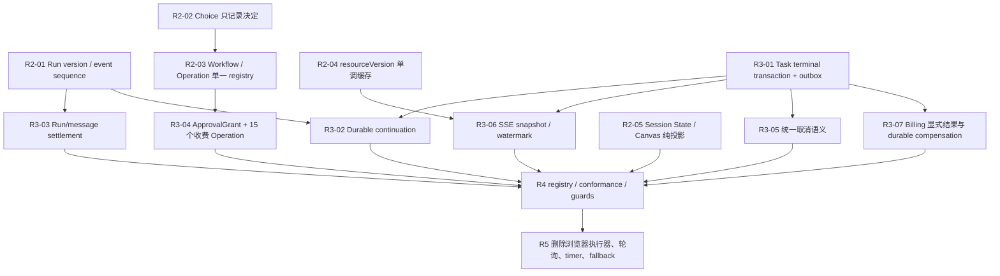

# Assistant 架构治理执行策略（临时）

> 状态：临时执行基线。每完成一个阶段，必须把稳定的不变量回写到对应架构模块文档，并删除本文件中已经完成的临时说明。全部治理完成后删除本文件。
>
> 审计基线：`exp/assistant` @ `de004a5aa`，2026-07-10。
>
> 后续执行交接基线：阶段 0/1 已推送至 `exp/assistant` @ `72c2be06d`；第 14—19 节记录该基线之后仍未完成的工作，后续执行前必须以当前 HEAD 重新核对行号与 registry 计数。
>
> 本文只定义治理顺序、唯一所有者、删除范围和验收闭环；它不是第二套运行时契约。发生冲突时，以 `AGENTS.md`、`docs/architecture/modules/*.md`、共享类型和已落地状态机为准。

## 1. 治理目标

Assistant 全链路最终只保留以下权威关系：

1. Choice 只记录不可变决定；Workflow 只根据正式事实计算 `stage`、`nextAction` 和允许能力。
2. Operation registry 是输入、审批分类、计划、报价、提交和输出契约的唯一来源。
3. Approval 必须绑定具体 OperationPlan；过渡期的 `confirmed` 只能来自真实用户确认，不能由内部执行器写死。
4. Task 是异步工作的权威事实；提交、重试、恢复、取消和终态只有一个状态机入口。
5. 资源、计费、Task 终态、TaskEvent、Wait 与 outbox 形成可恢复的原子交接。
6. Assistant continuation 由持久任务驱动，不由浏览器或进程内 Promise 链承担正确性。
7. Session State、SSE 和 Canvas 只投影带版本的权威状态，不从消息、文案、DOM 或 operationId 特判推断生命周期。

## 2. 已接受的审计修订

### 2.1 P0 收费确认断链采用两步迁移

不能让当前用户可见故障等待完整 ApprovalGrant 基建，也不能用硬编码 `confirmed: true` 热修。

第一步是类型化接通现有真实确认：

- 收费 Operation 的过渡输入必须在已确认调用分支中显式携带 `confirmed` 和计划报价信息。
- route、client、service 和 Task submitter 共用同一确认输入类型或 normalizer。
- `generate_edit_script_assets` 必须补齐 `plan → quote → commit`，不得继续由 service 内部临时规划收费 Task。
- 未确认、计划变化、重复提交、确认字段丢失必须有正负向集成测试。

第二步用 `ApprovalGrant` 替换布尔：

- Grant 至少绑定 user、project、episode、operationId、标准化输入指纹、计划指纹、报价上限、过期时间、消费状态和 requestId。
- Task 最终门禁验证 Grant 与当前计划一致且仅消费一次。
- API、Assistant tool 和 GUI 统一经过同一个 Operation invoke pipeline。
- 布尔确认旧入口在 Grant 全量切换后一次性删除，不长期双轨。

### 2.2 Assistant continuation 复用异步基础设施，但不预设为普通 Task

不新造独立 scheduler、job table 状态机或 retry policy。continuation 的持久权威是 Task terminal transaction 写出的 outbox command；BullMQ 优先复用为运输、worker lease、retry、dedupe 和 reconcile 基础设施，而不是终态权威。

是否把 continuation 暴露成正式 Task type，必须在 Task 单一 reconciler 和 terminal outbox 稳定后通过设计与 conformance 证明，不能提前决定。优先形态为：

`Task terminal transaction → AssistantContinuation outbox command → BullMQ transport → 唯一 continuation worker → CAS 消费 command → 统一 Assistant Run command`。

必须满足以下边界：

- continuation command 只消费已 resolved 的 Wait，并通过 `waitId + sourceRunId + continuationVersion` 幂等关联 source run、wait 和 continuation run。
- continuation 不进入媒体计费、Canvas target，也不得在完成后再次递归产生 task-terminal follow-up。
- 浏览器只读 continuation 状态，不再 claim 或执行。
- 进程内 `scheduledFollowUpChain` 删除。
- 如果最终证明适合作为正式 Task type，必须有独立 definition、queue routing、retry policy、payload schema、非计费声明与 registry conformance；不能落入 text queue 默认分支。
- 若现有异步基建不能表达 continuation 所需不变量，先补全共享边界，不允许在 Assistant 下新建私有队列状态机。

### 2.3 终态原子交接使用事务与 outbox

成功路径的目标顺序为：

1. provider/handler 在事务外完成不可回滚的外部工作。
2. 在同一 MySQL 事务内持久化正式业务资源、账务结算/回滚结果、Task 终态、terminal TaskEvent、Wait resolution 和 outbox。
3. 提交事务。
4. 事务外确认 BullMQ job。
5. outbox dispatcher 幂等投递 SSE、Assistant continuation 和 cache invalidation。

实施前必须测量事务内资源 DTO 读取的体量与锁时间。大 episode 不得把昂贵聚合或外部调用放进事务；可在事务前准备确定性数据，在事务内做版本校验和最终写入。

必须增加以下故障注入：资源写入前后、账务写入前后、Task terminal 前后、outbox 写入前后、事务 commit 后/BullMQ ack 前、Redis 投递前后、continuation 启动前后。

### 2.4 Run 状态机只使用现有真实状态集

当前状态集为：

- `running`
- `awaiting_choice`
- `awaiting_approval`
- `awaiting_task`
- `completed`
- `failed`
- `cancelled`

不为了对称新增 `queued`。每次转换必须校验合法前驱、run version/event sequence、requestId 和 terminal watermark。`completed`、`failed`、`cancelled` 不允许被旧事件反写。

control 必须先原子消费 interruption/wait，成功后才迁移 Run。心跳续锁失败不能忽略：失去锁所有权的 Run 必须停止模型流和后续写入，并进入明确的取消或失锁终态处理。

### 2.5 SSE 空窗按事件可恢复性治理

- 持久 lifecycle 事件可由 replay 追回，但仍需修复 bootstrap 与 subscribe 之间的水位协议，尤其是 cursor=0。
- 非持久 stream 增量无法靠当前 replay 完整恢复，是更高的实际风险；刷新后应以版本化正式 snapshot 重建，而不是拼接缺失 stream。
- `processedEventIdsRef` 必须改为最高连续 cursor 加有限乱序窗口，不能无限增长。

### 2.6 三个防遗漏项

- Choice 续跑中 operation 执行失败不得计入“已执行”并导致伪完成；纳入 Run settlement 状态机。
- `session-state GET` 不得承担 stale Run 取消写入；stale reconciliation 迁到唯一后台 reconciler。
- `processedEventIdsRef` 内存治理纳入 SSE 水位协议。

## 3. 明确不采用的方案

- 不通过新增局部 `if`、默认值、自动 fallback 或更长定时器治理。
- 不把 `confirmed: true` 写入内部 executor、service 或恢复路径。
- 不简单把 materialization/settlement 移到 Task completed 之后。
- 不新建第二套 Assistant continuation scheduler、job table 状态机或 retry policy。
- 不同时保留布尔确认和 ApprovalGrant 的长期双轨。
- 不让浏览器、历史消息或 Canvas renderer 成为业务生命周期写入者。
- 不因 Redis 不可用把 BullMQ job 判定为 missing。

## 4. 阶段 0：移除未闭合的 PlanRun 可执行面

### 目标

删除 PlanRun 的生产 runtime、公开 API、Operation registry 接线、Assistant/project context 投影和仅服务于该 runtime 的测试，防止未来误接线形成审批绕过和第二状态机。

### 本阶段删除

- `src/lib/plan-run-runtime/**`
- `src/app/api/plan-runs/**`
- PlanRun Operation definitions 与 registry wiring
- Project context、projection、phase 中的 PlanRun 读取
- 对应 route catalog 和仅验证 PlanRun runtime 的测试

### 本阶段不删除

- Prisma PlanRun/PlanStepRun/PlanRunEvent/PlanArtifact 模型
- 已应用或历史 migration
- 现有数据库记录

数据库结构删除属于独立高风险迁移，需要单独确认、数据保留策略和 rollback 方案。运行时代码删除后，遗留表只读且不再有生产入口。

### 验收

- 全仓无生产源码引用 `plan-run-runtime`、`create_plan_run`、`cancel_plan_run`、`retry_plan_step`。
- `/api/plan-runs/**` 不再进入 route catalog。
- Operation registry 测试证明 PlanRun operations 不存在。
- `no-plan-run-runtime` guard 进入 `test:guards`，阻止生产 runtime、API、operation 和 context marker 回流。
- typecheck、相关 unit/contract、guards 和 build:verify 通过。

## 5. 阶段 1：止血当前 P0

### 1A. 收费确认接通

权威入口：Operation plan/commit 与 Task submitter。

删除：route/client/service 手抄确认字段、无计划收费提交入口。

验证：每条 billable GUI/Assistant/API 链路的未确认拒绝、真实确认成功、计划变化拒绝、重复消费拒绝。

### 1B. Run 单调状态机

权威入口：ProjectAgentEvent reducer 中的共享 Run transition function。

删除：control 先写 running、任意状态 updateMany、失锁后继续写入、Choice 失败计为已执行。

验证：终态反写、重复 control、多标签页、晚到 stream、stale cancel 与 finish 竞争、失锁自我中止。

### 1C. VIDEO_GROUP 最终失败唯一写入者

权威入口：统一 worker final-failure → target-failure projector。

删除：`video.worker` attempt catch 的 `ProjectVideoGroup.failed` 直写和吞错。

验证：attempt 1 失败、attempt 2 成功期间 target 始终保持 generating，最终只写一次 completed。

### 1D. Task reconciler 与 Redis 四态

权威入口：单一 Task reconciler + durable TaskJobEnvelope。

删除：独立 watchdog Task 写入、startup 全量 processing→queued、重复 job data reconstruction、已删除 `maxAttempts` 语义。

Bull job observation 必须是 `alive | terminal | absent | unavailable`；只有明确 absent 才能做孤儿补偿。

验证：Redis timeout/disconnect 不创建第二 Task、不释放 dedupe、不回滚 billing；收费任务恢复保留完整 operation/billing metadata。

### 串并行约束

- 1A、1B、1C 可以由不同 owner 并行，因为分别拥有 Operation/Run/Video target 边界。
- 1D 与阶段 2 的 Task terminal/outbox 不能同时修改 Task service/reconcile/publisher；必须先完成 1D 或明确锁定接口后再进入阶段 2。
- 所有分支合并前由主审查者重新枚举写入者数量，禁止两个 agent 各自增加新入口。

## 6. 阶段 2：消除 Choice、Wait、Workflow 与 UI 多轨

### Choice

- 只持久化 immutable decision。
- 删除 Choice result handler 中的 project ratio、Bible、asset 等跨域写入。
- Workflow 根据 decision 产生正式 nextAction；副作用由 Operation 执行。

### Wait 状态准备

- claim 只作为租约协调；业务状态通过事件状态机推进。
- 为 continuation 定义 durable command identity 与失败、重试、耗尽、取消边沿，但本阶段不在 terminal outbox 落地前切换执行器。
- 现有浏览器 executor 和服务端 Promise chain 只在阶段 3 的 durable continuation 上线后同一变更删除，禁止先加第三入口。

### Workflow 与 Operation

- 删除第二套 `resolveEditFirstWorkflowCapabilityOperationIds` switch，prompt/tool/UI 读取同一 `allowedOperationIds`。
- 删除 `edit-first-operation-policy` 审批第二表，registry 成为唯一来源。
- Choice type、UI card、focus 和 runtime target 从 registry/definition 派生，删除 operationId 特判。

### UI/Session State

- 删除历史 message 状态 fallback。
- `session-state GET` 变成纯读。
- Canvas 删除 `__running` 和业务 status 预合并，只向纯 resolver 传事实快照。

## 7. 阶段 3：原子终态、唯一 continuation、取消语义和 ApprovalGrant

- 落地 Task terminal transaction/outbox 与 BullMQ ack 边界。
- 在 terminal outbox 稳定后接入唯一 continuation worker，并在同一变更删除浏览器 executor 与 `scheduledFollowUpChain`。
- 所有 terminal event 持久化；progress/stream 可按策略压缩或只实时传输。
- `canceled` 成为 Task、Event、Wait、Assistant、Canvas 的正式共享状态，不再映射为 failed。
- Run final message、Activity final event 与 Run terminal 进入 settlement 协议。
- 所有 `billable_media` Operation 强制 plan/quote/grant/commit；以 registry validation 和类型穷尽强制。
- Billing freeze/settle/rollback 使用显式结果类型，数据库异常不得伪装成余额不足；补 durable compensation reconciliation 与告警。

## 8. 阶段 4：注册式扩展和防线升级

- ChoiceDefinition registry。
- TaskDefinition registry，派生 queue、worker、retry、billing、target projector、materializer、presentation 和 conformance。
- Operation definition 派生 confirmation、planner、commit、UI card、focus policy 和 runtime target。
- Regex guard 优先升级为类型穷尽、registry validation 或 AST guard。
- `modules.json` 扩大 Assistant source/test/guard 覆盖到 routes、workflow、UI、Wait follow-up、SSE 和 Canvas integration。
- Guard 可达性检查必须证明每个 `guardPath` 被 CI 必跑命令引用。
- 行为质量 guard 覆盖 `tests/unit`，并验证新增测试实际被 runner 收集。

## 9. 阶段 5：删除体验性补丁

只有版本化事件、持久 continuation 和原子 settlement 已验证后，才能删除：

- 1.5 秒 session-state 正确性轮询
- thread catch-up 定时级联
- operationId/message fallback
- 依赖 TTL 的终态接力
- 非持久 terminal event
- 旧的 UI local lifecycle merge

refetch、轮询和 timer 可以保留为一致性校验或体验优化，但删除它们后不得暴露正确性空窗。

## 10. 每个工作项的完成定义

每个工作项必须在交付中回答：

1. 权威事实和唯一写入入口是什么？
2. 删除了哪些旧入口？
3. 写入者数量从多少降到多少？
4. 状态来源是否减少，是否仍存在双轨？
5. 正常、失败、取消、重试、重复、乱序、刷新和恢复中的适用边沿是否覆盖？
6. 新测试挂载到哪个必跑命令，runner 实际收集了多少文件/用例？
7. 哪个 guard 或类型约束保证旧旁路不能重新引入？
8. 对应架构模块文档、`modules.json`、共享类型、运行入口、测试和 guard 是否同步闭环？

未能回答任一项，不得宣称该架构工作完成。

## 11. 多 agent 执行规则

- 同一权威状态机同一时间只能有一个实现 owner。
- 其他 agent 可以并行负责只读证据、测试、guard、外围调用迁移，但不能同时修改同一核心文件。
- 每个 agent 开始前运行对应 architecture impact 并阅读必读模块文档。
- 子任务必须声明允许修改和禁止修改的文件边界。
- 主审查者负责全仓 `rg` 写入者复核、冲突检查、完整验证和最终提交。
- 并行化用于缩短独立工作流，不得以复制状态机、兼容层或临时 fallback 换速度。

## 12. P0 测试与 guard 挂载地图

新增测试文件不等于防线生效。下列每个工作包都必须同时进入对应必跑 suite：

| 工作包 | 必须覆盖的真实组合路径 | 必跑测试层 | 必须新增或补强的防线 |
|---|---|---|---|
| 收费确认接通 | GUI/API/Assistant → plan → operation → Task DB → billing freeze | unit、API integration、billing integration、system、regression | billable operation confirmation conformance；禁止未绑定确认与直接普通 `submitTask` |
| Run 单调状态机 | control consume、event reducer、DB status/version、双标签与失锁晚到写 | unit、API integration、system、regression | Run transition 穷尽 contract；Run status 单一写入者 guard；GET session-state 纯读 guard |
| VIDEO_GROUP retry | attempt 1 transient fail → queued → attempt 2 success/final fail → target projector | worker unit、task integration、system、regression | 禁止 worker attempt handler 直接写 target terminal |
| Task reconciler/JobEnvelope | startup、lease、Redis observation、恢复入队、billing/operation/trace 保留 | unit、task integration、system、regression | 单一 reconciler guard；TaskJobEnvelope conformance；scripts 独立 typecheck |
| Task terminal/outbox | resource、billing、Task、TaskEvent、Wait、outbox、Redis、BullMQ ack | task integration、billing integration、system、regression | terminal single-commit guard；terminal event 持久化 guard；outbox 幂等 conformance |
| Redis 四态 | alive、terminal、absent、unavailable 与 dedupe/P2002 路径 | unit、task integration、regression | observation 穷尽 union；禁止 queue error 映射 missing/absent |
| SSE/资源版本 | cursor=0、bootstrap gap、stream 缺失/乱序、旧 resourceVersion、多标签恢复 | unit、API integration、regression | snapshot/watermark contract；cache version guard；有界 event dedupe |

`tests/contracts/**` 当前不会被默认全量收集；新增 contract 必须有明确 package script，并加入 `test:guards`。阶段 1D 已把 `tests/integration/task/**` 纳入 `src/lib/task/**` 的 changed-file impact 证据。后续 agent 必须在改动尚存在于工作区时运行 impact guard，或显式指定可比较的变更范围；若在提交后的 clean worktree 运行并得到 `SKIP no changed files`，不能把该输出当作测试影响已验证。

## 13. 当前执行账本

### 阶段 0 — PlanRun 可执行面退役

- 状态：已完成并推送，commit `8751505cc`。
- 权威入口变化：PlanRun runtime、5 个 API route、6 个 Operation、Project Context/Projection/Assistant phase 读取入口全部删除；生产入口由大于零降为零。
- 删除规模：32 个相关文件发生删除或收敛，净删除约 2250 行。
- 保留范围：Prisma 模型、历史 migration 和现有数据库数据未修改。
- 防回流：Operation registry 负向断言；`no-plan-run-runtime` guard 已登记 Assistant 模块并加入 `test:guards`。
- 验证：全量 unit 347 files / 1451 tests；guards 通过；typecheck 通过；`build:verify` 通过；route 构建产物中已无 `/api/plan-runs/**`。
- 未完成的独立高风险项：统计遗留 PlanRun 表数据、制定保留/导出/drop migration 与 rollback；没有新的明确授权前不执行。

### 阶段 1A — 收费确认止血

- 状态：过渡止血已完成并推送，commit `92d554a96`；完整 ApprovalGrant 尚未开始，因此本工作项不能标记为最终完成。
- 权威入口：`OperationPlan → commitOperationPlan → operation.commit → submitPlannedOperationTask → Task submitter`。
- 删除的旧入口：`generateProjectEditScriptAssets` 及 service 内约 425 行资产创建、临时 Task 规划和私有提交逻辑；EditScript assets route 不再直接调用 service 执行器。
- `generate_edit_script_assets` 已改为只读 planner、准确 Task/billing 计划、显式确认、commit 前 requirement snapshot 校验、统一 Task submitter。
- 从首次业务写入开始，Task 提交、结果组装、正式 edit-script 回读、remaining count 和响应构造处于同一补偿域；失败会取消已提交 Task、恢复 requirement 原值并删除本次预留资产，补偿失败显式上报。
- GUI 的收费执行调用由共享 `confirmOperationPlan` 构造过渡确认；这只证明确认来自用户发起的计划执行动作，不具备 Grant 的计划指纹、过期和单次消费能力。
- Registry 实测：`billable_media` 共 31 个，具备 `plan+commit` 16 个，仍有 15 个未迁移：`ai_create_character`、`ai_create_location`、`ai_modify_appearance`、`ai_modify_location`、`ai_modify_prop`、`asset_hub_ai_design_character`、`asset_hub_ai_design_location`、`asset_hub_ai_modify_character`、`asset_hub_ai_modify_location`、`asset_hub_ai_modify_prop`、`asset_hub_reference_to_character`、`reference_to_character`、`regenerate_group`、`regenerate_single_image`、`revise_edit_script_assets`。
- 已验证：typecheck；核心 unit 6 files / 31 tests；API contract 3 files / 42 tests；EditScript lifecycle regression 1 file / 7 tests。尚缺一个真实 DB system fixture，把 asset planner/commit 与 billing freeze、queue、worker 串为同一条路径。

### 阶段 1B — Run 单调状态机与投影单写入者

- 状态：止血主干已完成并推送，commit `9672b24e8`；持久 `runVersion/eventSeq` 尚未实现，所以治理状态仍标记为部分完成。
- 状态集固定为七种，不引入 `queued`。Event reducer 校验合法前驱并以 `where(id,status=current)` CAS 写入；`completed/failed/cancelled` 不可被晚到事件重开。
- Approval/Choice interruption 的 `pending → consumed` 与 Run 的 `awaiting_* → running` 已进入同一个 event transaction；第二消费者命中 CAS 失败并得到 conflict 语义，不再因固定 idempotency key 被误判为成功。
- control 消费前的 `running` 写入和 server follow-up 的提前 `running` 写入已删除。Choice operation 只有 `ok:true` 才计入已执行，失败不再伪完成。
- DB heartbeat 返回 false、Redis renew 返回 false 或任一续租异常都会中止 Agents SDK 流，并统一进入 `cancelled/run_lock_lost`；不再忽略失锁或记成业务 `failed`。
- `session-state GET` 已删除 stale cancellation 写副作用。Interruption reopen 以 `consumedAt` 标识消费代次，失败显式上报。
- Workflow Lab 的 Run/Activity/Interruption 直接写入已删除。Choice 在 Lab clone 的同一事务内走 event reducer，Thread card、Event 与投影共用目标 runtime identity；不可恢复的 Approval checkpoint 只恢复业务快照，不再伪造可点击 interruption。真实 DB 验证 2 files / 3 tests，现有 Workflow Lab unit/route 2 files / 10 tests。
- 新 guard 扫描全 `src` 的 Run、Activity、Interruption 写入，只允许 event reducer 写生命周期；`heartbeatAt` 和已消费 interruption 的 `runState` 清理是两个显式非生命周期维护例外。
- 仍存风险：status-only CAS 无法区分 `running(A) → 其他状态 → running(B)` 的 ABA 代次；需要 schema 级 `runVersion/eventSeq`、terminal watermark 和真实 MySQL 双事务故障注入后，才能宣称 AR-05/AR-06 完整闭环。

### 阶段 1C/1D — Worker 最终失败与 Task reconciler

- 状态：已完成并推送，核心 commit `fc51998a4`，guard 读投影修正 `a30c7506e`。
- VIDEO_GROUP 和 style preview 的单次 worker attempt 不再提前写业务目标 `failed`；最终失败只由统一 Task final-failure projector 落地。
- 独立 Task watchdog 已删除；instrumentation 只启动共享 reconciler，不再直接改 Task 或做 startup `processing → queued`。
- Queue observation 明确为 `alive | terminal | absent | unavailable`；Redis 不可用不会被降级为 missing/absent，也不会释放 dedupe、回滚 billing 或创建第二 Task。
- 初次入队与恢复共用完整 JobEnvelope；billing、operation、scope、priority、locale 和 trace 不再由 watchdog 残缺重建。
- 已验证真实 MySQL + Redis 的 queued/absent 恢复与真实 Redis connection refusal 的 unavailable 零误恢复路径；最终合并状态已重跑全量 Task integration、regression、system 和 build。

### 阶段 1 合并验证

- 全量 `test:guards` 通过：Canvas conformance 85 tests、requirements matrix 2 tests、API route guard 105 routes，并包含 PlanRun、Task reconciler、worker attempt target terminal、Run/Activity/Interruption 单写入者和 hardcoded confirmation 防线。
- 全量 unit：355 files / 1486 tests。
- Billing integration：8 files / 35 tests；Billing concurrency：1 file / 4 tests。
- API integration：44 files / 208 tests；provider：10 files / 61 tests；chain：4 files / 9 tests；Task integration：3 files / 10 tests。
- system：2 files / 3 tests；regression：15 files / 49 tests。
- `typecheck`（含 runtime scripts）与 `build:verify` 通过；构建产物无 PlanRun API。
- 全量验证首次发现两类旧测试契约：tool adapter 曾把“实际产生收费媒体计划但 metadata 标成 none”视为可自动 commit；图片 route 测试只传 cost 不传确认。两者已改成显式拒绝/显式确认，commit `8f93e87e3`，没有放宽生产门禁。

### 阶段 1 结束时仍未验证/未完成

- Run 没有持久 `runVersion/eventSeq`，真实 MySQL 双事务、多标签页 ABA、late event 跨代覆盖仍未被版本围栏证明。
- `generate_edit_script_assets` 尚无一个真实 DB system test 将 planner、资产事务、billing freeze、queue、worker、终态和补偿串成同一场景；现有验证由 planner/commit regression 与独立 billing/task integration 组合提供。
- ApprovalGrant、剩余 15 个 billable Operation、Task terminal transaction/outbox、唯一 durable continuation、SSE bootstrap watermark、resourceVersion 比较、有界 event dedupe 尚未实施。
- Task terminal 后资源/账务/Wait/outbox 的 kill-test 矩阵尚未建立；因此阶段 2—5 仍必须继续，本文不能删除，也不能宣称 Assistant 全链路已经统一。

## 14. 给后续执行者的结论：现在不是“基本完成”，而是“止血完成、主干治理未完成”

### 14.1 当前总体判断

截至阶段 1，Assistant 架构的总体结论仍然是 **存在多轨**，置信度高。阶段 0/1 已经移除了 PlanRun 第二运行时、独立 Task watchdog、worker attempt 提前终结 target、Workflow Lab 生命周期直写，并接通了一个收费 Operation 的正式 plan/commit 链路；这些成果降低了立即重复执行、状态反写和审批绕过的风险，但尚未建立全链路共同依赖的版本围栏、原子终态、持久 continuation 和 Grant 授权。

换成自然语言：目前系统已经不再同时有那么多明显的“第二执行器”，但若数据库、Redis、浏览器连接或进程恰好在错误时间失败，仍可能出现“任务已经完成但页面不知道”“Run 显示完成但消息没保存”“Wait 已经满足但没人可靠续跑”“旧事件把新内容覆盖掉”“确认只是一个可重放布尔值”等问题。后续工作不是体验优化，而是把这些正确性责任移交给唯一的持久事实和状态机。

### 14.2 已完成与未完成边界

| 范围 | 当前状态 | 可以宣称的结果 | 不能宣称的结果 |
|---|---|---|---|
| PlanRun runtime | 已完成 | 生产可执行面和回流入口为零 | 遗留数据库表已经删除 |
| Task reconciler/Redis 四态 | 已完成 | Redis unavailable 不再等于 job absent；独立 watchdog 已删除 | Task terminal 已经原子化 |
| Run status CAS | 部分完成 | 非法转换、终态重开和一部分并发消费被挡住 | ABA、跨代晚到事件和多标签并发已被版本证明 |
| EditScript assets 收费确认 | 过渡止血完成 | 一个关键 Operation 已走 plan/quote/commit | 所有收费 Operation 已有不可重放 Grant |
| Choice/Workflow/Operation | 未完成 | 无 | Choice 已经只记录决定；Workflow 与 registry 已经单轨 |
| Task terminal/outbox | 未完成 | 无 | 资源、账务、Task、Event、Wait、continuation 已经同事务 |
| Assistant continuation | 未完成 | Wait 有持久记录 | continuation 本身可在进程崩溃后可靠恢复 |
| Run 最终消息 settlement | 未完成 | 持久化失败会写 error log | Run completed 一定对应可读的最终消息 |
| SSE/resourceVersion | 未完成 | lifecycle 有 replay，资源 envelope 携带 version | bootstrap 无空窗、旧资源不会覆盖新资源 |
| Session State/Canvas 投影 | 部分完成 | session-state GET 已是纯读，Canvas 已有共享 lifecycle resolver | renderer 与本地 tracked state 已不再复制业务运行态 |
| Billing 失败语义/补偿 | 未完成 | freeze/settle/rollback 有局部幂等与错误记录 | 数据库异常与余额不足严格区分，失败补偿一定可恢复 |
| 统一取消语义 | 未完成 | 各子系统内部多数能表达取消 | Task/Wait/Assistant/Canvas 使用同一协议状态 |
| 注册式扩展 | 未完成 | Operation 已有 registry 基础 | 新 Choice/Task/收费 Operation 只注册一次即可接通全链路 |
| 删除轮询和 fallback | 未开始 | 无 | UI 已经只靠权威 snapshot/event 正确运行 |

### 14.3 剩余工作的依赖顺序



这张图表达的是最低依赖，不代表所有工作必须串行。R2-01、R2-02、R2-04 可以由不同 agent 并行；R3-01 是 Task 主干独占工作；R3-02 必须等 R3-01 的 outbox 边界稳定后再切换；R5 必须最后执行，因为当前轮询和浏览器续跑虽然不应长期存在，但在持久替代物上线前直接删除会制造功能中断。

## 15. 后续工作包执行规格

下列每个工作包都必须按“原因 → 动机 → 目的 → 实施 → 删除 → 结果 → 验证”的顺序交付。后续 agent 不得只提交代码和一句“测试通过”；必须把本节对应工作包的执行记录补回第 17 节。

### R2-01：给 Run 增加持久版本围栏和事件序列

**优先级与状态**：P0，未开始。它是 durable continuation 和最终 settlement 的前置条件。

**当前证据**：

- `prisma/schema.prisma:569` 起的 `ProjectAgentRun` 只有 `status`、时间戳和错误字段，没有 `runVersion`、`eventSeq` 或 terminal watermark。
- `src/lib/project-agent/event/reducer.ts:129` 起的 `markRunStatus` 先读取当前 status，再用 `where: { id, status: currentStatus }` 做 CAS。这能阻挡同一时刻的状态竞争，但无法区分 `running(A) → awaiting_* → running(B)` 后到达的 A 代事件。
- `src/lib/project-agent/run-state-machine.ts` 允许多个等待态回到 `running`，所以单看字符串状态不能识别运行代次。

**原因与根因**：status 表达“当前处于什么阶段”，不表达“这是第几代运行”和“哪个事件有资格改变它”。当同一个 status 在生命周期内重复出现时，旧请求和新请求的 where 条件可能完全相同，形成 ABA。根因不是少一个 if，而是事件身份没有进入持久状态。

**动机与目的**：让任何 Run 写入都能回答“我基于哪个版本、消费哪个事件、是否晚于终态水位”。完成后，旧 stream、旧 control、多标签页重复提交和延迟 follow-up 即使抵达，也只能得到明确 conflict，不能覆盖新代状态。

**目标不变量**：

1. 每个 Run 创建时有明确初始 version/sequence。
2. 每个改变生命周期的 event 必须携带 expected version 或前序 event sequence。
3. reducer 在同一事务内校验并递增 version；失败返回明确 raced/stale 结果。
4. terminal watermark 一旦建立，低于或等于水位的非幂等事件不能再改变 Run、Activity 或 Interruption。
5. heartbeat 只能更新租约事实，不能递增业务 event sequence；失锁仍按阶段 1 的明确取消路径处理。

**实施边界**：

- schema、共享 event type、event append/reducer、所有 Run control 入口、session-state 投影和相应测试必须同一工作包切换。
- 先枚举所有 `appendProjectAgentEvents`、`updateProjectAgentRunStatus`、control route、server follow-up 调用；不得只改 reducer 后让调用者继续省略版本。
- migration 必须说明现有非终态 Run 如何初始化版本、发布时是否需要排空 in-flight Run。数据库结构变更按仓库高风险规则取得明确授权后执行。

**必须删除或收敛的旧逻辑**：status-only CAS；任何绕过事件 identity 的生命周期 helper；调用者自行假定“相同 status 就是同一次运行”的逻辑。不得保留“有 version 用 version、没有就只看 status”的长期兼容双轨。

**预期结果**：Run 生命周期写入者仍只有 reducer 一个，但写入资格从“状态字符串碰巧相同”提升为“状态、版本和事件身份都匹配”。多标签或旧网络响应只会返回 stale/conflict，不会改变正式投影。

**验证**：

- unit：完整转换表、同 version 双写只成功一次、terminal watermark、heartbeat 不推进业务 sequence。
- API integration：同一 interruption 两个 control 请求并发，只有一个消费并产生下一版本。
- MySQL integration/system：两个真实事务模拟 ABA；A 读取 version 1，B 推进至 version 3 并回到 running，A 的 version 1 写必须失败。
- regression：晚到 stream error、旧 follow-up、重复 approval/choice、刷新后重放不能覆盖新代。
- guard：全 `src` 生命周期写入仍只允许 reducer；新增 event type 必须穷尽携带版本策略。
- 必跑命令：`test:guards`、Assistant unit、API integration、system、regression、`typecheck`、`build:verify`。

**完成判据**：必须报告 schema 字段、所有入口迁移清单、写入者前后数量、真实双事务结果和 in-flight 发布策略。只有 mock 的 unit test 不足以完成。

### R2-02：让 Choice 只记录不可变决定，副作用全部变成 Operation

**优先级与状态**：P1，未开始。

**当前证据**：

- `src/app/api/projects/[projectId]/assistant/chat/route.ts:334` 在 Choice control 后调用 `applyEditFirstChoiceResultSideEffects`。
- `src/lib/project-agent/edit-first-choice-result.ts:186` 起根据 `choiceType` 直接批准脚本、修改 `Project.videoRatio`、确认 Bible、批准资产，并带有一套局部补偿事务。
- 这意味着 Choice 同时承担“记录用户决定”和“执行 Project/Bible/Asset 写入”，其失败语义与 Operation/Task/Workflow 不一致。

**原因与根因**：Choice result handler 成为跨域命令总线。新增 Choice 时，开发者容易继续在这个文件加入一段私有写逻辑，绕过 Operation 的输入契约、审批分类、幂等、Activity 和测试防线。

**动机与目的**：Choice 只回答“用户选了什么”。Workflow 根据这一事实计算 nextAction；真正修改 Project、Bible、Asset 的行为必须由注册过的 Operation 执行。这样失败时不会出现“决定已消费，但部分副作用成功”的模糊状态。

**目标不变量**：

1. Choice event 持久化不可变 decision、choiceType、actor、run/version 和 requestId。
2. Choice reducer 不直接修改 Project/Bible/Asset/Task/Billing。
3. Workflow 纯计算下一步 Operation；Operation 自己声明输入、权限、审批、写入与结果。
4. Choice 消费成功不等于副作用成功；Operation 失败必须使 Activity/Run 进入明确失败或可重试状态。

**实施步骤**：

1. 为现有 `script_review`、`bible_review`、`asset_review` 逐一找出最接近的 Operation；能力不足时补全现有 Operation，不新建 route 私有 service。
2. 把 aspect ratio、approve/confirm 等输入放入共享 Operation schema，并由 Workflow nextAction 传递。
3. 让 choice continuation 明确执行 Operation，成功后再推进 Workflow。
4. 删除 `applyEditFirstChoiceResultSideEffects` 及 route 接线；相应测试迁移为 Choice 纯记录 + Operation 行为测试。

**必须删除**：`edit-first-choice-result.ts` 的跨域写入和补偿状态机；chat route 中 Choice 专用副作用调用；任何用 Choice 文案或 output shape 猜测要写哪个表的逻辑。

**预期结果**：新增 Choice 只需登记 definition 和 Workflow transition，不需要再修改一个隐藏副作用 switch。Choice 失败与 Operation 失败不再混为一谈。

**验证**：

- 负向 guard：Choice reducer/result handler 不得 import Prisma、Task submitter、Billing 或 Project/Bible/Asset writer。
- 组合测试：记录 choice 后 Operation 尚未执行时，业务资源不应变化；Operation 成功后才变化；Operation 失败时 decision 仍可审计但 Workflow 不伪完成。
- 并发测试：同一 Choice 重复提交只消费一次，Operation 依靠 requestId/plan identity 幂等。
- 回归测试：Bible ratio 修改失败、资产批准失败、脚本批准失败都不留下部分成功。

**完成判据**：Choice 跨域写入者从 1 降为 0；每种现有 Choice 都有明确 `decision → nextAction → Operation` 对齐表。

### R2-03：合并 Workflow capability、审批分类和 Operation registry

**优先级与状态**：P1，未开始，可与 R2-01 并行，但 R3-04 ApprovalGrant 依赖本项。

**当前证据**：

- `src/lib/project-workflow/edit-first.ts:738` 起用 `resolveEditFirstWorkflowCapabilityOperationIds` 按 stage 维护第二套 switch，尽管 Workflow state 已经包含 `allowedOperationIds`。
- `src/lib/project-agent/toolset.ts:203` 读取这个二次 resolver 决定 tool capability。
- `src/lib/project-workflow/edit-first-operation-policy.ts:27` 维护 `EDIT_FIRST_OPERATION_APPROVAL_KINDS` 第二张审批表。
- `tests/unit/operations/registry.test.ts:137` 通过遍历第二张表检查 registry，两套定义即使同时错也可能互相“对齐”而通过。

**原因与根因**：Workflow 计算结果、tool exposure 和审批政策分别保存同一事实。测试检查的是两份副本相等，而不是证明只有一份权威来源。

**动机与目的**：Workflow 只返回实际 `allowedOperationIds`；所有消费者直接读取它。Operation registry 直接声明 confirmation/plan/commit，任何收费 Operation 缺 planner 或 Grant policy 时在类型或 registry validation 阶段失败。

**实施步骤**：

1. 枚举 `resolveEditFirstWorkflowCapabilityOperationIds` 的所有调用，改为消费 Workflow state 的 `allowedOperationIds`。
2. 删除 stage→operation 的第二 switch；Workflow reducer 是唯一产生 allowed set 的位置。
3. 删除 `EDIT_FIRST_OPERATION_APPROVAL_KINDS`，让 prompt/tool/UI/plan route 从 Operation definition 读取 confirmation。
4. 把“billable_media 必须有 plan+commit+grant policy”做成 registry 穷尽验证，不再用人工列表。
5. UI card、focus policy、runtime target 若仍有 operationId switch，登记到 R4 的 definition 扩展，但当前项不得新增新副本。

**必须删除**：`resolveEditFirstWorkflowCapabilityOperationIds`、`EDIT_FIRST_OPERATION_APPROVAL_KINDS` 以及以二者为真源的测试。

**预期结果**：Workflow 决定当前能做什么；Operation definition 决定怎么做和是否审批。新增 Operation 不需要同步修改两个政策表和一个 capability switch。

**验证**：

- unit：每个 Workflow fixture 直接断言 `state.allowedOperationIds`。
- registry conformance：所有 Workflow 暴露的 operationId 都存在；所有 billable definition 都有 planner/commit/Grant policy；禁止反向孤儿 Operation。
- tool/API/UI contract：三种入口对同一 Operation 得到相同 allowed/confirmation 语义。
- guard：删除的两个 symbol 不得回流；不得新增按 stage 复制 allowed set 的 resolver。

### R2-04：让 `resourceVersion` 真正阻止旧资源覆盖新资源

**优先级与状态**：P1，未开始，可独立于 Task terminal 主干先实施比较协议。

**当前证据**：

- `src/lib/workspace-resource/materialized-resource.ts:60,83` 分别为 editBible 使用数值 version 字符串、为 episodeData 使用 ISO `updatedAt`。
- `src/lib/query/materialized-resource-cache.ts:109` 在校验 envelope 后直接 `setQueryData(queryKey, envelope.data)`；它既不读取当前 cache 的 version，也不比较新旧。
- 当前 Query Cache 只保存裸 DTO，version 没有与缓存值一起持久维护，因此后到的旧 terminal envelope 可以覆盖先到的新 DTO。

**原因与根因**：version 只是传输字段，不是状态更新的门禁。不同资源还使用不同格式，通用层无法安全按字符串猜顺序。

**动机与目的**：任何 cache/store 写入都必须证明新 snapshot 不旧于当前 snapshot；事件到达顺序不能决定最终内容。

**目标不变量与实施**：

1. 定义按资源 kind 的共享 version 类型和 comparator，或统一为数据库生成的单调版本；禁止通用代码靠字典序比较未知字符串。
2. Query Cache 保存 `{ data, resourceVersion }` 的权威 envelope，或另有唯一 version store 与 data 原子更新；renderer 仍只消费纯 DTO 投影。
3. 相同 version 的重复事件幂等；较旧 version 明确返回 ignored；不可比较或缺失 version 显式报错，不 fallback 为覆盖。
4. optimistic mutation 必须有自己的 provisional identity，并在正式 version 到达时按明确规则交接，不能把本地时间冒充服务端版本。

**必须删除**：无条件 `setQueryData` terminal handoff；任何仅按 taskId 或到达顺序接受资源的路径。

**预期结果**：SSE 乱序、多标签、replay 和 refetch 交错时，旧 DTO 无法覆盖新 DTO。`resourceVersion` 从装饰字段变成强制门禁。

**验证**：连续 version、重复 version、旧 version、不同 taskId 同资源、refetch 新于 SSE、SSE 新于 refetch、刷新重建；至少覆盖 editBible 数值版本和 episodeData 时间版本。增加负向断言，证明旧数据没有调用实际 cache replace。

### R2-05：让 Session State 和 Canvas 只投影事实，不复制业务生命周期

**优先级与状态**：P1/P2，部分基础已经存在，但完整收敛未开始。

**当前证据**：

- 阶段 1 已让 `session-state GET` 成为纯读，这是可复用基础。
- `src/features/project-workspace/canvas/workspace-node-runtime.ts:121-153` 已有纯 `resolveWorkspaceCanvasNodeData`，输入明确区分 persisted、Task、stream 和 submitting facts。
- 但 `src/features/project-workspace/canvas/nodes/WorkspaceNode.tsx:74` 又把 resolver 的 `isRunning` 复制为 `data.__running`，`WorkspaceNodeRenderers.tsx` 多处直接读取 `__running`，形成 renderer 私有状态别名。
- `src/features/project-workspace/components/workspace-assistant/useWorkspaceAssistantRuntime.ts:557-561,870-900` 仍把 server Activity、local tracked Run、operationId 和 pending 状态再次合并；这些字段是否只是短暂提交事实、还是业务生命周期，需要逐项收敛到唯一 resolver。
- `src/features/project-workspace/components/workspace-assistant/async-task-follow-up.ts:261` 对 `generate_edit_script` 有 operationId 特判来补推 Task target，说明正式 Operation result 契约仍不完整。

**原因与根因**：服务端已经提供 Run/Activity/Task 等事实，但 UI 为了方便渲染又制造 `__running`、tracked run、pending operation 和 operationId 推断。每个局部 hook/renderer 都能改变“当前是否运行中”的解释，最终同一页面可能同时显示 spinner、完成内容和旧错误。

**动机与目的**：UI 只能拥有两类本地状态：尚未获得服务端身份的提交中事实，以及纯交互状态（展开、选中、hover）。一旦获得 runId/taskId/operationId，业务生命周期必须由 session snapshot、Task snapshot、resource snapshot 和 stream snapshot输入同一个纯 resolver。

**目标不变量**：

1. Session State 是 Run/Activity/Interruption/Wait 的只读正式快照；GET route 和 hook 不修复、不取消、不重写业务状态。
2. Canvas lifecycle 只由现有共享 resolver 产生；renderer 接收 `data.lifecycle`，不得读取 `__running` 或自行合并 status。
3. local submitting 只覆盖“请求已发出但还没有服务端 identity”的窗口；收到 runId/taskId 后立即移交，不保留第二个 running 标记。
4. Operation result 必须显式返回 taskType/targetType/targetId/runtime target；UI 不用 operationId 猜 target。
5. 历史 message、文案、DOM、有无内容只用于展示，不能作为 pending/completed 判断。

**实施步骤**：

1. 建立 Assistant UI 和 Canvas 的状态所有权表，逐个列出 `sessionState`、tracked run、controlPending、submitting、Task runtime、stream patch、persisted lifecycle 的保留原因与失效边界。
2. 把 renderer 的 running 判断全部改为读取 `lifecycle`；删除 `__running` 字段和相关类型。
3. 收敛 Assistant hook 的 server/local merge 为一个纯 resolver，输出 loading card、button disabled、pending interaction 和 focus request；hook 只负责取事实与保存纯 UI state。
4. 补齐 Operation result/runtime target 共享契约，删除 `generate_edit_script` 等 operationId target 推断。
5. durable continuation/SSE 上线后，再按 R5 删除承担正确性的 polling/timer。

**必须删除**：`__running` 别名；renderer 私有运行态判断；operationId 推断 Task target；历史消息/内容 fallback；local tracked run 在已有 server identity 后继续拥有生命周期。

**预期结果**：同一组事实无论进入 loading card、Canvas node、focus-follow 还是按钮禁用，都得到同一 lifecycle。新增 UI card 只消费 definition + resolver，不复制状态机。

**验证**：提交前、获得 identity、queued、processing、首个/多个 stream、completed materialized handoff、failed、canceled、retry、晚到 stream、旧 resourceVersion、刷新、断线、多标签。增加负向 guard 禁止 `__running` 和 renderer status merge 回流；关闭 polling 后的验证留到 R5。

### R3-01：建立 Task terminal transaction 与 outbox 单一提交点

**优先级与状态**：P0，未开始。此项必须独占 `src/lib/task/**`、`src/lib/workers/shared.ts`、Billing terminal 和 Wait terminal 核心文件。

**当前证据**：

- `src/lib/workers/shared.ts:274-309` 的成功路径依次 settle billing、更新 Task billingInfo、`tryMarkTaskCompleted`，然后才 `publishLifecycleEvent`；handler 和 materialized resource 读取发生在此前。
- `src/lib/task/publisher.ts:324-360` 在另一个步骤创建 `TaskEvent`、调用 `resolveProjectAgentWaitsForTaskEvent`、发布 Redis，并以进程内方式 schedule follow-up。
- 任一步崩溃都会留下不同组合：资源已写但 Task 未完成、Task 已完成但 Event/Wait 未写、Wait 已 resolved 但 Redis/continuation 未投递。当前没有 outbox model 承担 commit 后的可恢复投递。

**原因与根因**：一个业务终态被拆成多个独立提交和非持久副作用，BullMQ retry 只能重跑 job，无法判断哪些业务步骤已经提交。简单调整先后顺序只会移动分裂窗口。

**动机与目的**：建立一个数据库事实：terminal commit 成功，意味着资源、账务、Task、terminal Event、Wait 和待投递 command 已经共同提交；失败则全部没有提交。Redis、SSE、cache invalidation 和 continuation 都只消费 outbox，不参与数据库原子性。

**目标架构**：

`provider/外部工作 → TaskDefinition 产生 terminal commit intent → 单一 MySQL transaction 写资源/账务/Task/Event/Wait/outbox → commit → BullMQ ack → outbox dispatcher 幂等投递`

**实施要求**：

1. 先枚举所有 Task handler 当前直接写入的正式资源和 target；外部 provider 调用必须在事务外，正式 DB mutation 必须能接收同一个 Prisma transaction client。
2. 定义共享 `TaskTerminalCommitIntent`/显式结果类型；禁止 `any`，禁止 handler 完成后由 shared worker 猜测写了哪些资源。
3. 成功、最终失败、取消分别有穷尽 terminal command。单次可重试 attempt 不进入 terminal transaction。
4. Billing settle/rollback 返回区分业务拒绝、余额问题、数据库异常和已结算幂等结果；数据库异常不得伪装成余额不足。
5. terminal TaskEvent 必须持久化于同一事务；Wait resolution 也必须使用该 transaction，而不是 publisher 事后扫描。
6. outbox 记录至少有 command id、kind、aggregate identity、payload/version、attempt、可重试时间、claimed/processed 时间和最后错误；唯一键保证重复 terminal commit 不产生两个 continuation。
7. dispatcher 可以复用 BullMQ 作为运输和重试，但 outbox row 是投递权威；不得新建第二套业务 Task 状态机。
8. BullMQ job ack 在事务之外。commit 后、ack 前崩溃时，job 重送必须通过 terminal CAS/outbox 唯一键幂等吸收。
9. 测量事务时间、锁等待和大 episode DTO 体量；昂贵读取和外部调用不得放进事务。

**必须删除或改造**：worker 中分段 `settle → update billingInfo → mark completed → publish`；publisher 中 terminal Event 创建、Wait 解析和直接 schedule continuation；任何 terminal Redis publish 承担正确性的路径。progress/stream publisher 可以保留实时职责，但不能写 terminal 事实。

**预期结果**：数据库里不再出现“Task completed 但 terminal Event/Wait/outbox 不存在”的合法状态。Redis 不可用只造成 outbox backlog，不造成业务终态回滚或重复 provider 执行。

**故障注入验证矩阵**：

| 注入点 | 必须观察到的结果 |
|---|---|
| 正式资源写入前/后 | transaction rollback 后资源、Task、账务、Event、Wait、outbox 全部不前进 |
| Billing 写入前/后 | 不产生 completed Task；已冻结资金保持可由 reconciler 恢复的明确状态 |
| Task terminal 写入前/后 | 不存在 Event/Wait/outbox 的半终态 |
| TaskEvent/Wait/outbox 写入前/后 | transaction 全回滚，重试后只生成一套记录 |
| commit 后、BullMQ ack 前 | job 可重送，但 provider 不重复执行，terminal/outbox 幂等 |
| outbox claim 后、Redis/BullMQ 投递前后 | command 可再次领取，消费者按 command id 幂等 |
| dispatcher 永久失败 | backlog、attempt、lastError 和告警可见，不静默跳过 |

**必跑验证**：Task/Billing integration、并发、system、regression、真实 MySQL+Redis kill test、guards、typecheck、build。必须记录 transaction p50/p95/最大锁持有时间和测试文件/用例数。

**完成判据**：terminal 生命周期写入者从 worker+publisher+wait resolver 多点收敛为一个 transaction service；outbox dispatcher 只是投影者。若仍有任何 Task kind 在 transaction 外直接写 terminal 资源，必须明确列为未完成，不能宣布本项完成。

### R3-02：用 durable continuation 替换浏览器 claim 和进程内 Promise 链

**优先级与状态**：P0，未开始，严格依赖 R3-01。

**当前证据**：

- `src/lib/project-agent/server-follow-up.ts:23,217` 用模块级 `scheduledFollowUpChain` 串行 schedule；进程退出会丢失链中的工作。
- `src/lib/task/publisher.ts:360` 在 terminal publish 后调用 `scheduleResolvedProjectAgentWaitFollowUpsForTaskEvent`，它不是持久提交的一部分。
- `src/features/project-workspace/components/WorkspaceAssistantPanel.tsx:409-508` 仍通过 `/assistant/waits` claim resolved follow-up，并按 interval、terminal SSE 和页面状态触发 `submitTaskFollowUp`。
- 因此浏览器在线与服务进程存活都可能成为 Assistant 是否继续运行的正确性条件，而且存在两个执行入口。

**原因与根因**：Wait 是持久事实，continuation 却是临时动作。系统把“应该继续”记录在 DB，却没有把“继续一次”建模为持久、可认领、可重试的 command。

**动机与目的**：Task terminal transaction 一旦 resolve Wait，就必须同时产生唯一 continuation command。无浏览器、断网、服务重启后仍能继续；重复投递只产生一个 continuation Run。

**目标不变量**：

1. command identity 为 `waitId + sourceRunId + continuationVersion`，与 terminal outbox 同事务产生。
2. 唯一 worker claim command，校验 Wait resolved、source run/version 和 followUpMode，再调用统一 Assistant Run command。
3. continuation Run 创建与 command consume 有 CAS/唯一键，worker crash 后可以安全重试。
4. continuation 失败记录 attempt/lastError；耗尽后把 Wait/Run 投影到明确失败并可人工观察，不吞错。
5. 浏览器只显示状态，不 claim、不创建 continuation、不决定何时继续。

**实施顺序**：先新增 durable consumer 并用故障注入证明，再在同一个切换变更中删除两个旧执行入口。禁止先保留浏览器作为“兜底”；那会把双轨永久化。

**必须删除**：`scheduledFollowUpChain`、publisher 的进程内 scheduler、`WorkspaceAssistantPanel` 的 claim/poll/send follow-up 执行逻辑，以及仅服务于浏览器 executor 的 API action。读取 Wait 状态的 GET 可保留为纯投影。

**预期结果**：关闭所有浏览器后 Task 完成，Assistant 仍会恰好继续一次；刷新、多标签和重复 terminal event 不会产生第二个 continuation Run。

**验证**：无浏览器成功、worker 在 claim 后崩溃、Run 创建前后崩溃、重复 outbox 投递、两个 worker 并发 claim、Wait 被取消、source run version 已变化、follow-up 最终耗尽、Task 完成后 follow-up 首次失败再成功。system test 必须使用真实 DB 和 queue，不得只 mock `claimResolved...` 返回值。

### R3-03：把最终 Assistant message、Activity 和 Run terminal 变成一个 settlement

**优先级与状态**：P1，未开始，依赖 R2-01；最好复用 R3-01 的 outbox/重试基础设施。

**当前证据**：

- `src/lib/project-agent/runtime.ts:1145` 起的 `persistAssistantMessageOrLog` 捕获消息持久化异常后只记录日志，不重新抛出，也不撤销或改变已经写入的 Run terminal。
- `tests/unit/project-agent/runtime-routing.test.ts:1244` 的 `logs assistant message persistence failures during stream settlement` 明确断言 HTTP 200、stream 正常 drain 和 error log；这把“消息没保存但运行仍算完成”固化成了期望行为。

**原因与根因**：最终消息、Activity settlement 和 Run terminal 是三个可分离动作，成功定义只看模型/stream 是否结束，没有把“用户刷新后能读到最终结果”作为 completed 的必要条件。

**动机与目的**：`completed` 必须意味着最终 assistant message 可从权威 thread 读取，相应 Activity 已终结，Run terminal 与 message 使用同一个 request/run identity。持久化失败必须显式阻止 completed，而不是仅写日志。

**目标不变量与方案边界**：

1. 使用确定性 message id（现有 `createPersistedAssistantMessageId` 可复用）保证 retry 不重复消息。
2. 最终 message append、Activity final event、Run terminal/version increment 在同一数据库 transaction 或同一可恢复 settlement command 中完成。
3. 不为好看随意新增 `settling` 状态；若确实需要新持久状态，必须先证明七状态无法表达并同步更新完整状态机、文档和 UI。
4. 对 stream 已发给客户端但 DB settlement 失败的情况，API/stream 必须暴露明确错误；后台可以重试 settlement，但不得提前投影 completed。
5. failed/cancelled 路径也必须用确定性 settlement，避免错误消息和终态互相丢失。

**必须删除**：`persistAssistantMessageOrLog` 的吞错完成语义；把 logger 调用当作 durable recovery 的测试；Run completed 先于最终消息持久化的路径。

**预期结果**：只要 session-state 显示 completed，刷新 thread 必定能读到对应 final message。若 DB_DOWN，用户看到显式失败/待恢复事实，监控有可重试 settlement，而不是一个空白的“已完成”。

**验证**：message 写入前后 kill、Run terminal 前后 kill、重复 settlement、客户端断开、stream error、cancel、follow-up completion、相同 requestId 重试。测试必须把旧用例改为断言“不能 completed”，并增加真实 DB transaction 验证。

### R3-04：落地 ApprovalGrant，并迁移剩余 15 个收费 Operation

**优先级与状态**：P0/P1，未开始。R2-03 完成后实施；可与 R3-01 由不同 owner 并行设计，但两者都触碰 Task submitter 时必须串行合并。

**当前证据**：

- `src/lib/operations/planning.ts:86` 的 `ConfirmedOperationPlanInput` 只有 `confirmed: true` 与可选 `confirmedMaxCost`。
- `src/lib/query/operation-plan-client.ts:69` 在拿到 plan 后构造这个布尔输入；多个 route、tool adapter 和 Operation commit 仍出现 `confirmed: true`。
- 阶段 1 实测 31 个 `billable_media` Operation 中只有 16 个具备 planner+commit，剩余 15 个清单见第 13 节。

**原因与根因**：布尔值不能证明谁在何时确认了哪个标准化输入、哪个计划和哪个报价，也不能可靠防重放。部分收费 Operation 还没有正式 plan/commit，因此只能在执行路径临时构造费用和 Task。

**动机与目的**：用户确认变成一份有身份、范围、版本、过期和单次消费语义的授权事实。GUI、API 和 Assistant tool 最终都提交同一种 Grant，而不是各自解释 `confirmed`。

**Grant 最低字段**：userId、projectId、episodeId、operationId、normalizedInputHash、planHash、quote ceiling/currency、issuedAt、expiresAt、consumedAt、requestId、version；必要时保存 plan snapshot 或其不可变引用。敏感输入不应无必要明文复制。

**实施步骤**：

1. 先定义输入 canonicalizer、plan fingerprint 和 quote fingerprint，确保 route/client/tool 使用同一实现。
2. 建立 issue Grant 与 consume Grant 两个明确 command；consume 在 Task 最终提交门禁处做 CAS，只成功一次。
3. 计划变化、输入变化、报价超过 ceiling、过期、跨项目/用户/episode、重复消费全部明确拒绝。
4. 逐一为剩余 15 个 Operation 补齐只读 plan 和 commit；不得在 commit 内重新规划出与 Grant 不同的 Task。
5. GUI/API/Assistant 迁移到相同 invoke pipeline 后，一次性删除 `ConfirmedOperationPlanInput` 和生产 `confirmed: true`。
6. 测试 fixture 中仍可表达“已签发 Grant”，但不得继续用裸布尔绕过真实门禁。

**必须删除**：生产代码中的布尔确认协议、直接普通 `submitTask` 的收费入口、Operation 私有报价逻辑、长期兼容“有 Grant 验 Grant、否则信 confirmed”。

**预期结果**：任何收费 Task 都能追溯到未过期且与当前计划完全一致的 Grant；同一 Grant 无法提交两次；新增收费 Operation 若缺 plan/commit/grant policy 会在 registry validation 失败。

**验证**：

- 7 条最低验收：未确认拒绝、真实确认成功、输入改变拒绝、计划改变拒绝、报价上升拒绝、过期拒绝、重复消费拒绝。
- 再覆盖跨 user/project/episode、并发双消费、Task 创建后 enqueue 失败补偿、Task dedupe 命中、Assistant interruption 恢复。
- 每个剩余 Operation 都要有 `参照物触点 → 覆盖/不适用` 对齐表；优先以已迁移的 `generate_edit_script_assets` 和最接近同媒体类型 Operation 为参照。
- system：至少一条图片、一条视频、一条音频和 EditScript assets 从 plan/Grant 到 Task DB/billing freeze/queue/worker 贯通。

**完成判据**：registry 计数必须从 `31 billable / 16 planned / 15 unplanned` 变为所有 billable 均有统一 plan/commit/Grant；以实施时重新枚举的实际数字为准并附脚本输出。

### R3-05：统一取消语义，不再把 canceled/cancelled 映射成 failed

**优先级与状态**：P1，未开始，需与 terminal event 和 Wait protocol 同批切换。

**当前证据**：Task、Query 和 Canvas 普遍使用 `canceled`；Assistant Run、Activity 和 Event 使用 `cancelled`。`src/lib/project-agent/waits.ts:252` 当前把 `TASK_STATUS.CANCELED` 归一成 `TASK_EVENT_TYPE.FAILED`，因此 Wait/Run 无法保留“用户取消”这一真实原因。

**原因与根因**：拼写差异只是表象，真正问题是跨层没有共享终态 union，取消在桥接层被降级为失败。UI、重试、Billing rollback 和告警因此可能采用错误政策。

**动机与目的**：取消是独立业务终态：不重试、通常回滚未结算费用、UI 显示用户/系统取消、Wait 和 continuation 按明确政策处理，不能触发失败告警或伪装 provider error。

**实施要求**：

1. 以已在 Task/Canvas 广泛使用的 `canceled` 作为目标共享协议值，或在实施设计中给出选择另一拼写的全量成本证据；不能两者长期并存。
2. 一次性迁移 Task Event、Wait、Assistant Run/Activity、session-state、SSE、Canvas resolver、i18n 和 tests。
3. 对数据库已有字符串和 in-flight event 制定排空或有删除期限的显式迁移；禁止永久 normalizer 同时接受两套并静默输出。
4. Wait terminal union 增加 canceled；follow-up policy 明确 canceled 时不 resume agent，除非产品定义了专用取消 continuation。

**必须删除**：`canceled → failed` 映射、双拼写兼容散落、把取消错误文案当作识别依据的业务判断。

**预期结果**：从 Task cancel 到 Wait、Run、SSE、Canvas，用户看到的都是同一取消事实；Billing 和 retry policy 不再误按失败处理。

**验证**：用户取消、系统失锁取消、排队取消、processing cancel、重复 cancel、cancel 与 complete 竞争、取消事件乱序、刷新恢复、多标签；负向断言失败 projector/告警未被调用。

### R3-06：建立 SSE snapshot/watermark 协议和有界去重

**优先级与状态**：P1，未开始。持久 lifecycle 可先修握手；完整终态协议依赖 R3-01，资源正确性依赖 R2-04。

**当前证据**：

- `src/app/api/sse/route.ts:104-144` 先读取并发送 bootstrap events，之后才调用 `addChannelListener`；两步之间到达 Redis 的事件可能丢失。
- `src/lib/query/hooks/useSSE.ts:15,33,67-69,158` 以 5 秒轮询 replay 持久 lifecycle，但 `processedEventIdsRef` 是无限增长 Set。
- stream 事件默认非持久，丢失后无法靠 replay 补全；刷新只能依靠正式 snapshot，而当前资源 version 又尚未作为门禁。

**原因与根因**：连接没有定义原子水位。client 只记“见过哪些 id”和最大 id，却不知道 snapshot 覆盖到哪个 cursor，也不知道缺口是否连续。轮询可以偶然追回持久事件，但不能证明无空窗，更不能恢复 stream 增量。

**动机与目的**：每次连接先建立“snapshot 覆盖到 watermark W”这一事实，再只应用 `> W` 的持久事件；乱序事件进入有限窗口，连续 cursor 前进后释放旧 id。stream 只负责即时体验，正式资源 snapshot 负责刷新后的正确性。

**推荐握手**：先订阅并把 live event 暂存；再读取 snapshot + DB high watermark；发送 snapshot/replay；按 cursor 去重并排序 flush buffer 中高于 watermark 的持久事件；最后进入 live。若采用其他方案，必须同样证明 bootstrap 与 subscribe 无不可见区间。

**实施要求**：

1. 定义 cursor=0、无事件、cursor 过旧、跨 project/episode 的精确语义。
2. lifecycle event 使用持久 TaskEvent/outbox cursor；mutation/resource event 若需要 replay，也必须有对应持久 identity，不能混用 ephemeral id 假装连续。
3. 客户端维护 `highestContinuousCursor + bounded out-of-order map`，设定窗口上限与超限后的显式 snapshot resync。
4. `processedEventIdsRef` 删除；内存必须有上界。
5. stream 缺失/parse error 不尝试从文本拼回状态；触发版本化 snapshot 校验。

**必须删除**：bootstrap 后订阅的空窗实现；无限 Set；把 5 秒 replay poll 当作正确性；从 stream 文案或局部 chunk 推断正式终态。

**预期结果**：连接、断线、重连、乱序和 replay 后，持久生命周期最终一致且不会旧写覆盖；非持久 stream 丢失只影响动画/即时增量，不影响刷新后的正式资源与状态。

**验证**：bootstrap 查询期间注入事件、subscribe 刚完成注入事件、cursor=0、重复/乱序/缺号、窗口溢出、两标签不同水位、断线重放、旧 resourceVersion、stream 中间段丢失。API integration 应控制真实消息时序，不能只断言 listener 被调用。

### R3-07：让 Billing 使用显式结果，并建立 durable compensation reconciler

**优先级与状态**：P0/P1，未开始。它与 R3-01 属于同一 terminal owner，不能由两个 agent 同时修改 Billing/Task terminal 核心。

**当前证据**：

- `src/lib/billing/ledger.ts:113-174` 的 `freezeBalance` 用 `string | null` 同时表达余额不足、非法金额和失败；其 catch 在 P2002 以外记录日志后也返回 `null`。
- `src/lib/billing/service.ts:779-782` 看到 `freezeBalance` 返回 `null` 就重新读取余额并抛 `InsufficientBalanceError`。因此数据库连接、事务或未知异常可以被错误报告成余额不足。
- `src/lib/billing/service.ts:944-972` 的 `rollbackTaskBilling` 捕获 rollback 异常后只返回 `billingInfo.status = failed`；Task submitter/reconciler 虽会标 `BILLING_COMPENSATION_FAILED`，但目前没有持久 compensation command 保证之后继续重试和告警闭环。

**原因与根因**：Billing API 用 nullable/状态字符串压缩了不同失败类别，调用者只能猜原因。补偿又依赖当前请求或 reconciler 机会性重试，不是独立持久责任。

**动机与目的**：冻结、结算和回滚必须返回穷尽结果，业务拒绝与基础设施失败严格分离；任何未完成补偿都生成 durable command，直到成功或进入明确人工处理状态。

**目标结果类型**：至少区分 `frozen/already_frozen`、`insufficient_balance`、`invalid_quote`、`settled/already_settled`、`rolled_back/already_rolled_back`、`conflict`、`infrastructure_error`。具体命名可调整，但调用者不得再从 null、message 或普通 `failed` 猜原因。

**实施要求**：

1. ledger transaction 抛出的未知异常原样包装为 infrastructure error，绝不转成余额不足。
2. R3-01 terminal transaction 直接消费显式 Billing result；只有明确业务拒绝才走用户可理解的余额/报价错误。
3. settle 失败后的 rollback 若也失败，在同一可提交边界写 compensation outbox；Task/Run 投影显示补偿未完成，不伪装正常 failed terminal。
4. compensation consumer 以 freezeId/taskId/billingKey 幂等重试，保存 attempt、nextRetryAt、lastError 和告警状态。
5. 建立对账：Task terminal 与 BalanceFreeze/Transaction 的不变量扫描；差异必须可见并可安全修复，禁止静默自动改写未知状态。

**必须删除**：`freezeBalance` 的 catch→null；上层 null→InsufficientBalance 推断；rollback catch→普通 status failed 后没有持久责任；从错误文案识别 Billing 类别。

**预期结果**：数据库故障会明确显示基础设施错误且可重试，不会误导用户充值；回滚暂时失败不会丢失，恢复后只执行一次，账务与 Task 最终可对账。

**验证**：真实 DB disconnect/timeout/deadlock、余额不足、P2002 并发幂等、settle 成功、settle 失败 rollback 成功、settle 与 rollback 都失败、consumer 重启、重复 command、永久失败告警、Task terminal/BalanceFreeze 对账。Billing concurrency 和 Task system suite 都必须覆盖，不能只 mock ledger 返回值。

### R4-01：把 Choice、Task、Operation 和 UI 投影升级为注册式扩展

**优先级与状态**：P2，未开始。前述生命周期稳定后实施，不能用 registry 包装现有双轨而不删除旧 switch。

**原因与动机**：当前新增一种 Choice、Task 或 UI card 仍需要人工搜索多个 switch、policy、renderer 和测试。遗漏任何触点就会形成“能提交但 UI 不显示”“能执行但无法重试”“收费但没审批”等不对称行为。

**目的**：definition/registry 声明静态契约，状态机和唯一运行入口执行动态生命周期。registry 不是万能业务文件，而是让缺失触点在编译/验证时暴露。

**最低交付**：

- `ChoiceDefinition`：type、input/output、display、nextAction mapping、是否需要用户交互；不包含跨域写入。
- `TaskDefinition`：payload、queue、worker handler、retry policy、billing policy、target projector、terminal committer/materializer、presentation、cancellation policy。
- `OperationDefinition`：input/output、channels、confirmation、planner、commit、runtime target、UI card/focus policy。
- 对每个新增同类实例强制生成 AGENTS.md 要求的全触点对齐表。

**必须删除**：被 registry 完整覆盖的 operationId/taskType/choiceType switch、重复 approval 表、默认 queue 分支、默认 renderer/fallback。未注册值必须显式失败。

**验证与 guard**：TypeScript `satisfies` 穷尽、registry uniqueness、AST 单写入者 guard、所有 definition conformance、route/tool/UI 三入口一致性、CI guard reachability、changed-file impact。必须证明新增一个测试文件会被必跑 suite 实际收集。

### R5-01：删除浏览器执行器、轮询、timer 和历史 fallback

**优先级与状态**：P2/P3，未开始，只能在 R2/R3/R4 的持久替代物全部通过后执行。

**当前证据**：

- `src/features/project-workspace/components/WorkspaceAssistantPanel.tsx:446-508` 有 Wait follow-up claim、interval 和 SSE 触发执行。
- `src/features/project-workspace/components/workspace-assistant/useWorkspaceAssistantRuntime.ts:805-863` 有 Run 转换后的多次 thread catch-up timer 和 1.5 秒 session-state poll。
- `src/lib/query/hooks/useSSE.ts:15,158` 有 5 秒 replay poll；在水位协议完成前它仍承担部分补偿作用。

**原因与动机**：这些机制最初用于弥补状态传播空窗，但也掩盖丢事件、非原子 settlement 和浏览器执行权。长期保留会让系统“看起来经常能自愈”，却无法证明真正的正确性。

**目的**：UI 只投影 session snapshot、版本化 resource 和持久事件。refetch/轮询可以作为低频一致性校验，但删除后业务仍必须正确。

**删除顺序**：

1. durable continuation 验证后删除浏览器 Wait claim/poll/send。
2. Run/message settlement + SSE Run event 覆盖后删除 1.5 秒正确性轮询和 thread timer cascade。
3. snapshot/watermark 稳定后，把 5 秒 replay 轮询改为断线恢复/一致性校验，而非持续正确性来源。
4. 删除 operationId、历史 message、DOM/content、TTL 保留等生命周期 fallback。

**结果与验证**：在测试中关闭所有 timer、禁用浏览器 executor、模拟刷新/断线/多标签，成功、失败、取消、重试和 continuation 仍能收敛。CPU/请求量应下降，但性能不是完成标准；正确性不依赖 timer 才是标准。

### QA-01：补齐 EditScript assets 的真实全链路 system test

**优先级与状态**：P1，阶段 1 遗留，未完成。它可以先于 ApprovalGrant 建立过渡 fixture，Grant 上线时必须同步迁移。

**原因与目的**：现有 planner/commit regression、Billing integration 和 Task integration 分别证明局部行为，但没有一个真实 DB 场景证明同一次用户确认产生正确 plan、资产预留、billing freeze、Task DB、queue job、worker terminal 和失败补偿。组合缝隙正是历史回归最容易发生的位置。

**必须覆盖**：

1. 正常路径：plan 输出精确 task/cost，确认后创建资产与 Task，freeze 一次，enqueue 一次，worker 成功后 requirement/资源/Task/账务一致。
2. enqueue 失败：取消已建 Task、回滚预留资产和 requirement、账务不悬挂。
3. 第二个子 Task 创建/入队失败：第一项也进入同一补偿域，不留下部分批次。
4. 重复确认/dedupe：不重复冻结、不重复 provider 执行。
5. worker 最终失败：rollback 一次，正式 target/requirement 进入统一失败状态。
6. 后续升级：ApprovalGrant 重复消费、过期和 plan 改变。

**完成判据**：测试使用真实 MySQL 与 Redis/queue 测试基础设施，明确记录 runner 收集文件数/用例数，并接入 `tests/system/**` 的必跑命令；只 mock submitter 或 queue 不合格。

## 16. 后续 agent 的文件所有权与并行规则

为了提速，可以并行，但不能让两个 agent 同时拥有同一个状态机。下面是建议的独占边界：

| Owner | 可拥有的核心范围 | 同期禁止其他 agent 修改 | 可并行的外围工作 |
|---|---|---|---|
| Run version owner | Prisma Run 字段、`project-agent/event/**`、Run controls | Run reducer、Run migration、Run state tests | 其他 agent 只读枚举 UI 消费者 |
| Choice/Workflow owner | Choice event、Workflow reducer、Operation capability/confirmation registry | `edit-first-choice-result`、Workflow allowed operations、toolset capability | UI definition 盘点、测试 fixture 迁移 |
| Task terminal owner | `task/service/publisher/types`、`workers/shared`、Billing terminal、Wait terminal、outbox | 任何 queue/reconcile/terminal writer | 其他 agent 写 fault-injection 设计，但不改核心 |
| Continuation owner | outbox consumer、Wait follow-up、统一 Run command | 浏览器 Wait executor、server follow-up | UI 只读投影测试 |
| SSE/version owner | SSE route/replay、`useSSE`、materialized cache/version | cursor 和 resource resolver | API 时序 fixture、内存上界测试 |
| Approval owner | planning/Grant/invoke pipeline、15 个 Operation | Task submitter 的 Grant gate；与 Task owner 串行协调 | 各 Operation planner 可按 domain 分派，但共享接口由一个 owner 定义 |
| UI projection owner | Assistant runtime resolver、Canvas lifecycle consumer、Operation result target contract | `__running`、tracked run merge、renderer status | renderer 机械迁移可分派，但 resolver 由一个 owner 定义 |

### 16.1 强制协作协议

1. 每个 agent 开工前把“允许修改文件、禁止修改文件、依赖 commit、预计删除入口”写入本文件执行记录。
2. 共享核心只接受一个 owner；其他 agent 发现需要改核心时先发送证据和建议，不直接覆盖。
3. 每个高内聚工作包形成独立 commit；不要把 Run、SSE、Approval 和 Task terminal 混成一个无法审查的大 commit。
4. 合并前主审查者用 `git show` 阅读正文和关键 diff，并重新运行全仓写入者检索；不能只看 agent 总结。
5. 若 agent 只增加新入口而没有删除旧入口，默认拒绝合并。
6. 若测试通过依赖放宽 guard、把错误改为 warning、增加默认值或 fallback，默认拒绝合并。

## 17. 每个工作包必须回填的交付记录模板

后续 agent 完成任一工作包后，把以下模板复制到本节下方填写。没有证据的项目写“未验证”，不得写“应该”。

```md
### [工作包 ID] [名称]

- 状态：未开始 / 进行中 / 部分完成 / 已完成 / 阻塞
- 负责人：
- 基线 commit：
- 结果 commit：
- 原因：当前哪一条事实分裂或失败窗口需要治理
- 动机：为什么局部补丁不能解决
- 目的：完成后必须成立的不变量
- 权威事实：
- 唯一写入者：
- 消费者/投影者：
- 修改文件：
- 删除的旧文件/入口/状态：
- 写入者数量：修改前 N，修改后 N
- 状态来源：减少了哪些，是否仍有双轨
- 正常路径结果：
- 失败/取消/超时/重试/重复/乱序/刷新/恢复结果：
- migration 与 in-flight 策略：
- 新增或更新测试：
- 测试挂载命令：
- runner 实际收集：X files / Y tests
- guard/类型防线：
- architecture impact 与必读文档：
- modules.json/架构文档同步：
- 未验证范围：
- 已知风险与下一依赖：
```

## 18. 阶段性和最终验证清单

### 18.1 每个工作包最小验证

- 运行 `npm run architecture:impact -- <实际修改文件>`，逐份阅读命中的模块文档。
- 运行直接相关 unit/integration/system/regression；异步改动必须包含真实事件序列与负向断言。
- 运行 `npm run test:guards` 并确认新增 guard 被脚本实际执行。
- 运行 `npm run typecheck`。修改 runtime script 时确认 script 没被 tsconfig exclude 绕过。
- 运行 `npm run build:verify`，禁止使用会与 dev server 冲突的普通 build。
- 在 commit 前运行 changed-file impact；clean tree 的 `SKIP` 不算验证。

### 18.2 阶段 2/3 合并门禁

- 全量 unit、API integration、Billing integration/concurrency、Task integration、provider、chain、system、regression、guards、typecheck、build:verify 全部通过。
- Redis、MySQL、queue 依赖无法运行的 suite 必须列为审计盲区，不能用 mock suite 替代结论。
- 重新统计 billable Operation、Run 写入者、Task terminal 写入者、continuation 执行入口、SSE cursor 来源和 UI lifecycle resolver 数量。
- 检查新增测试已被必跑 runner 收集，并在记录中写明 files/tests 数。

### 18.3 最终 Goal 完成门禁

只有同时满足下列条件，才可以删除本文并宣称 Assistant 架构治理完成：

1. Choice、Workflow、Operation、Approval、Task、Wait、Run、SSE、Session State 和 Canvas 的权威事实/写入者矩阵每项只有一个业务写入入口。
2. R2-01 至 R2-05、R3-01 至 R3-07、R4-01、R5-01 和 QA-01 全部完成，没有“以后再删”的浏览器执行器、布尔确认、status-only CAS、terminal 分段写入或旧状态无条件覆盖。
3. 成功、失败、取消、拒绝、超时、重试、重复提交、部分成功、刷新、断线、多标签、并发 Run、失锁、乱序、replay、enqueue 失败、terminal 后 continuation 失败都有真实组合验证。
4. 对应模块文档、`modules.json`、共享类型/registry/状态机、唯一运行入口、测试和 guard 六层一致。
5. Git 历史中识别出的同类回归均有结构性防线，而不是仅有一条针对当前例子的 regression test。
6. 所有未运行的依赖和环境盲区明确列出；存在关键盲区时 Goal 不得标完成。

## 19. 已知但非本轮治理完成证明的验证提示

- 阶段 1 的全量命令已通过，但 build 曾输出既有 lint warning；后续若 warning 变化，应区分新引入与既有问题，不能把“build exit 0”解释为零警告。
- unit 运行曾出现 `assets.overview.propAssets`、`assets.overview.propCounts` i18n missing message 输出但 suite 通过。它不直接证明 Assistant 主干失败，也不能被静默忽略；若后续修改相关 UI/i18n，需单独收敛并记录。
- 当前临时文档没有被 `architecture:impact` 映射为正式模块；这是刻意避免把临时计划当运行时契约。真正改变不变量时必须更新对应正式模块和 `modules.json`，不能只修改本文。

## 20. 2026-07-11 Task terminal / Outbox 阶段性交付与后续接管说明

### 20.1 提交边界与准确状态

- 状态：**部分完成，已形成可审查主干，但不得宣称 R3-01、R3-02、R3-03、R3-05 或 R3-07 完成**。
- 基线 commit：`b7a18bb6b`。
- 阶段结果 commit：`fac392c99 refactor(task): centralize terminal handoff`，已推送到 `origin/exp/assistant`。
- 本批修改规模：48 个文件，新增 2817 行、删除 1830 行。
- 本批唯一实现 owner：Task terminal / Outbox / Wait continuation owner。其他 agent 只做了只读审查，没有并行覆盖核心状态机。
- 验证事实：Task/Wait/Run/reconciler 定向基线曾通过 7 files / 29 tests；提交前重新生成 Next route types 后，`npx tsc --noEmit --pretty false` 通过；staged 与全仓 secret scan 通过。
- 未运行：真实 MySQL + Redis 故障注入、全量 unit/integration/system/regression、`test:guards`、`build:verify`。这些不是可选清理，而是本工作包仍未完成的明确门禁。

### 20.2 原因、动机与本批目标

**原因**：原终态由 worker、submitter、cancel/timeout service、reconciler、publisher、Wait resolver 分段写入。资源、账务、Task、TaskEvent、Wait 和 Assistant continuation 可以在不同事务、不同进程、甚至仅通过 Redis 瞬时事件推进。任何一步崩溃都会产生“资源完成但 Task 未完成”“Task 完成但 Wait 未解除”“账务处理了但终态未落库”等组合状态。

**动机**：继续给每个入口补 rollback、refetch、timer 或 watchdog，只会让更多模块拥有“修复终态”的写权限。真正需要减少的是终态写入者和可达状态组合，而不是增加一次成功概率。

**本批目的**：先建立一个共享 `commitTaskTerminal` 入口，使提交失败、最终 worker 成功/失败、取消、超时和对账恢复都提交同一种 terminal intent；在同一数据库事务中处理 Task 终态、账务、持久 TaskEvent、Wait 投影与 Outbox command；事务提交后的 SSE 和 Assistant continuation 只消费 Outbox，不再由浏览器决定是否继续。

### 20.3 当前状态所有权

| 事实 | 当前权威 | 当前唯一业务写入入口 | 消费者/投影者 | 本批结果 |
|---|---|---|---|---|
| Task 成功/失败/取消 | `Task.status` + terminal TaskEvent | `src/lib/task/terminal/service.ts` 的 `commitTaskTerminal` | query、SSE、target projector、Wait | 主要入口已迁移；真实 DB 原子性未验证 |
| 执行输出 | `TaskExecutionCheckpoint` | worker shared checkpoint service | Terminal Service | 已建立，但 provider/handler 到 checkpoint 之间仍有崩溃窗 |
| 初始执行身份 | `Task.executionFingerprint` | Task 创建入口 | worker、recovery JobEnvelope | 新 Task 已固化；旧 active Task 发布策略未完成 |
| 终态账务 | Billing ledger / freeze | Terminal Service 调用显式 transaction API | balance、audit | 同事务方向已建立；完整对账与故障矩阵未验证 |
| 持久终态事件 | `TaskEvent` | Terminal Service | SSE、Wait、诊断 | 已加入 idempotency key；重放/乱序真实测试未完成 |
| Wait terminal | `ProjectAgentWait` | terminal transaction 通过 reducer 投影 | session-state、continuation | canceled 已正式表达；旧读侧 claim helpers 尚未删除 |
| 事务后命令 | `OutboxCommand` | Terminal Service transaction | Outbox dispatcher/worker | 已建立固定 BullMQ jobId、lease 与重试骨架；真实 Redis 故障序列未验证 |
| Assistant continuation | Wait + Outbox command | server-side outbox worker | Assistant runtime | 浏览器执行器/API 已删除；跨事务可重放 settlement 仍未闭环 |
| UI follow-up | Session/Wait 投影 | 无业务写权 | Workspace Assistant | 浏览器 claim/poll/send loop 已删除 |

### 20.4 本批已经完成的结构性收敛

1. 新增 `src/lib/task/terminal/**`，把 worker success/final failure、submit validation/enqueue failure、cancel、timeout、dedupe orphan 和 reconciler terminal intent 路由到同一个服务。
2. 新增 `OutboxCommand`、repository、dispatcher、queue 和 worker；DB row 是投递权威，BullMQ 只是运输。Outbox 使用固定 jobId、严格 payload 解析、lease owner、过期回收和幂等键冲突比较。
3. 新增不可变 `executionFingerprint` 和 `TaskExecutionCheckpoint`，避免把会被 progress 合并修改的 `Task.payload` 当作恢复执行身份。
4. Billing freeze/settle/rollback 增加事务内显式入口；freeze idempotency collision 会比较 user、task 和金额，不再把不同请求静默当作相同授权。
5. `canceled` 进入 Task event、Wait、Activity 和 Run 投影，不再无条件伪装成 failed；取消不会触发普通失败 follow-up。
6. 删除浏览器 continuation 的两个生产 API：
   - `/assistant/waits`
   - `/assistant/runs/[runId]/task-follow-up`
7. 删除 Workspace Assistant 中 claim、轮询和主动提交 task follow-up 的执行 loop；浏览器不再是 continuation dispatcher。
8. Terminal publisher 对绕过 Terminal Service 的 terminal publish 显式失败，不允许旧调用者继续偷偷发 completed/failed/canceled。

### 20.5 尚未完成的 P0：外部执行 exactly-once 仍未证明

**触发场景**：provider 已生成内容或 handler 已写正式资源，但进程在 `saveTaskExecutionCheckpoint` 之前崩溃。BullMQ 重试后仍会再次调用 provider 或再次执行 handler side effect。

**根因**：当前 checkpoint 在整个 handler 返回之后才保存。它能阻止“checkpoint 已 ready、terminal transaction 失败”后的 provider 重跑，却不能覆盖“provider/资源写成功、checkpoint 尚未保存”的窗口。

**为什么局部补丁不够**：在 worker catch 中猜资源是否已存在，或用 target status 推断 provider 是否执行过，会重新引入第二事实源和按 TaskType 扩散的启发式。

**下一步统一方案**：按 TaskDefinition 穷尽声明执行协议。对可分离的 Task，先把 provider result 作为不可变 execution result checkpoint 落库，再由幂等 resource projector 以 `taskId + executionFingerprint + expectedVersion` 写正式资源；不能分离的 provider 必须证明并使用 provider idempotency key。每个 TaskType 必须明确属于哪一种协议，禁止默认分支。

**必须验证**：在 provider 返回后、checkpoint 前；checkpoint 后、resource projector 前；resource projector 后、terminal transaction 前分别 kill。每个位置重启后 provider 调用次数、资源版本和账务次数都必须精确为一。

### 20.6 尚未完成的 P0：continuation retry 与最终消息 settlement 仍分裂

**触发场景 A**：`activity.started` 已持久化，随后 LLM、消息持久化或 finalize 失败。release 把 Wait 改回 resolved，但 Wait 保存的 fence 没随 `activity.started` 推进；同一 command 重试时，已有 idempotency event 与当前 Run fence 冲突，可能永久得到 `PROJECT_AGENT_EVENT_IDEMPOTENCY_FENCE_CONFLICT`。

**触发场景 B**：assistant message 已持久化，进程在 `finalizeProjectAgentWaitFollowUp` 前崩溃。当前 server follow-up 没有用 commandId 设置稳定 requestId；重试可能再次调用模型，并用不同 messageId 写第二条 assistant message。

**触发场景 C**：消息持久化与 `wait.followed + Run terminal` 是两个事务。任一事务单独成功都可能留下“消息存在但 command 未完成”或“将来错误重放”的中间态。

**根因**：Outbox 已经持久，但 continuation 内部还没有一个持久 execution/settlement checkpoint；HTTP response body drain 也不是业务成功事实。

**下一步统一方案**：commandId 必须同时成为稳定 requestId、Activity identity、assistant message identity 和 continuation execution identity。模型输出或可重放 response 必须先形成 durable checkpoint；随后在一个显式 settlement transaction 中验证 claim owner/lease/fence，幂等持久消息，并成批 append `wait.followed`、Activity 和 Run 最终事件。重试先读取 checkpoint，不重新调用模型。不得新建第二套 scheduler；继续复用同一个 Outbox worker。

**必须验证**：正常 completed、awaiting_task、awaiting_choice、awaiting_approval、tool failure、消息 DB_DOWN、started 后 kill、message 后 kill、terminal watermark、旧 owner finalize 与新 owner reclaim 并发。每条路径必须证明 provider/LLM 与 message 各最多一次，Outbox 最终 accepted 或明确 dead-letter。

### 20.7 尚未完成的 P0/P1：target projector 没有全 TaskType 所有权契约

当前 `src/lib/task/target-failure-sync.ts` 对 `EDIT_SOURCE_SCRIPT_GENERATE` 和 `EDIT_BIBLE_GENERATE` 直接返回，因为对应模型没有可用于终态 CAS 的 task ownership 字段。这避免了错误覆盖，但会让失败目标继续停在 `generating`。未知 target/type 也存在静默 return，不能作为最终架构。

**根因**：TaskDefinition 没有穷尽声明 terminal target ownership、success handoff 和 failure/cancel projector。不同 handler 仍隐式知道要写哪个业务表。

**下一步统一方案**：为需要终态投影的业务模型增加明确 `generationTaskId` 或等价 execution identity；TaskDefinition 必须穷尽声明 `terminalHandoff` 与 `terminalFailureProjector`。projector 只允许 `where(id, generationTaskId, activeStatus)` CAS；unknown/missing definition 在编译或 guard 阶段失败，不得运行时静默跳过。

**必须验证**：旧 Task 晚到、Task retry、用户启动新 Task、取消、最终失败、重复 terminal event。旧 execution 必须不能覆盖新资源或新错误。

### 20.8 尚未完成的发布风险：旧 active Task 没有 executionFingerprint

schema 为现有数据兼容暂时把 `Task.executionFingerprint` 设为 nullable，但新 worker 对缺失值显式失败。部署时若仍有 queued/processing Task，它们可能立即变成 `TASK_EXECUTION_FINGERPRINT_MISSING`。

**禁止方案**：从已被 progress 污染的数据库 `Task.payload` 静默回填；这会制造一个与原始执行输入不相等的假身份。

**可接受方案二选一**：

1. 发布前排空 active Task，并用只读查询证明 queued/processing 为零；或
2. 一次性从仍存活的 BullMQ 原始 JobEnvelope 读取 immutable input，按 taskId CAS 初始化，记录迁移窗口和删除日期。

ApprovalGrant 上线后 execution fingerprint 还必须一次性用 `approvalGrantId + operationExecutionId` 契约重算，删除当前 `operationConfirmed` 布尔，不保留双轨 fingerprint。

### 20.9 尚未删除的旧代码与明确删除条件

虽然生产浏览器路由和 UI loop 已删除，`src/lib/project-agent/waits.ts` 仍保留：

- `reconcilePendingProjectAgentWaitsForScope`
- `listResolvedProjectAgentWaitFollowUps`
- `claimResolvedProjectAgentWaitFollowUps`

它们当前没有公开生产 route，但仍表达旧“读取时修复/浏览器 claim”语义。下一工作包在 durable continuation 的 settlement/retry tests 通过后必须删除这些函数及只服务于它们的测试和类型。不得因为“目前没有调用者”长期保留成未来可恢复的第二入口。

### 20.10 测试、guard 与正式文档缺口

当前定向 unit 只能证明 intent 传递和局部 reducer 行为，不能证明事务/队列/崩溃恢复。后续必须新增并挂入必跑脚本：

1. 真实 MySQL terminal transaction：资源/账务/TaskEvent/Wait/Outbox 任一步抛错均整体 rollback。
2. 真实 Redis outbox：enqueue 后未 mark、mark 后 job 丢失、Redis unavailable、consumer crash、lease 过期、重复 job、poison payload。
3. checkpoint recovery：ready checkpoint + 多次 progress payload 修改 + Redis job 丢失，恢复时跳过 provider 并完成 terminal。
4. commit 后、BullMQ ack 前 kill：重复 job 由 checkpoint/outbox idempotency 吸收。
5. continuation 的全部 settlement/claim/reclaim/消息故障序列。
6. canceled 在 Task、Event、Wait、Run、Session State、SSE、Canvas 的全链路组合验证。

正式闭环还必须同步：

- `docs/architecture/modules/async-task-lifecycle.md`
- `docs/architecture/modules/assistant-run-lifecycle.md`
- `docs/architecture/modules/billing-approval.md`
- `docs/architecture/modules.json`
- 禁止第二 terminal writer、禁止浏览器 continuation executor、TaskDefinition terminal policy 穷尽、Outbox consumer 单一入口等 guards。

在上述测试、guard 和正式文档完成前，`fac392c99` 只能称为“主干切换提交”，不能称为完整架构迁移。

### 20.11 下一执行顺序与文件所有权

1. **先修 continuation 可重放 settlement**：独占 `runtime.ts`、`server-follow-up.ts`、`waits.ts`、event reducer、Outbox continuation consumer；删除剩余旧 wait helpers。
2. **再补 TaskDefinition target ownership 与 provider checkpoint 协议**：独占 `task/**`、`workers/shared.ts`、target projectors 和相关业务模型。
3. **补真实 MySQL/Redis fault tests、正式文档、modules 与 guards**，形成 R3-01/R3-02/R3-03/R3-05/R3-07 的真实完成证据。
4. 上述共享主干稳定后，Choice owner 才开始 snapshot-bound Choice、Bible revise Task 和稳定 workflow boundary；Approval owner 才开始 ApprovalGrant，避免再次覆盖 Task schema/submitter。
5. SSE/UI owner可以先做不碰 Terminal 的水位协议设计与 architecture mapping；涉及 terminal materialized handoff policy 时必须等待 TaskDefinition owner 提供共享穷尽契约。

### 20.12 PlanRun 边界复核

用户要求的“删除 PlanRun runtime”已经在 `8751505cc` 完成：生产 runtime、公开 API、Operation pack、Assistant/Project Context/Projection 读取和专用测试均已删除，`no-plan-run-runtime` guard 已挂入 `test:guards`。当前只保留 Prisma 历史模型和 migration。

这些历史表不是可执行面。删除表会造成数据删除和 schema 风险，且当前与 Task terminal migration 冲突；没有新的明确数据删除授权时不得顺手 drop。后续若要删除，必须先只读统计 PlanRun/Step/Event/Artifact 数量与非终态数据，决定归档/保留策略并单独执行可恢复的 migration。

## 21. 2026-07-11 Assistant Goal 独占执行记录（进行中）

> 本节记录当前 Goal 的实际执行事实。未完成或未运行的验证必须保留“未验证”字样；在所有工作包闭环前不得删除本临时文档或把 Goal 标记完成。

### 21.1 所有权与并行边界

| 工作包 | 唯一 owner | 允许修改的核心 | 明确禁止重叠 |
|---|---|---|---|
| Choice / Workflow / Style Operation | Choice agent，主 agent 复核 | Choice Offer、canonical decision、Workflow nextAction、Style Operation、对应 UI | Approval transaction、Task terminal、SSE cursor |
| ApprovalGrant / OperationExecution | Approval agent | planned invocation、approved batch、19 个 billable commit/projector | continuation、Choice、SSE、Task terminal/reconcile |
| SSE / Resource Version / Canvas | SSE agent | materialized DTO/version/cache、SSE client projection、Canvas resolver | Approval、Choice、Task terminal/reconcile |
| Continuation / Run settlement | 主 agent | server follow-up、Wait checkpoint、Thread append、Run final settlement | Approval business commit、queue/reconcile |
| Task target ownership / old style parent deletion | Choice agent 第二工作包 | TaskDefinition terminal projector、EditBible ownership、旧 parent Task 全触点 | Approval transaction、SSE、continuation |

共享工作区不使用 agent 私自 commit 作为隔离手段；每个 owner 只修改表中边界，主 agent 最终逐文件审查关键 diff 并统一验证。

### 21.2 Choice / Workflow 当前结果与动机

**原问题**：Style Choice 先由浏览器 PATCH Bible/Project，再消费持久 Choice。该写入会改变 Offer fingerprint，导致随后 consume 稳定报 stale；旧 style generation card 还使用空 interruption/tool identity 形成第二执行入口。

**已实施结果**：

1. 所有 Choice card 只使用 `submit_tool_output`，Panel、renderer、旧 generation card 不再写 Style/Bible/Project。
2. 删除专用 Style Preview PATCH route 和客户端 mutation hook；领域写入只保留 registry Operation `confirm_edit_style_preview`。
3. Workflow 将持久 style decision 映射到该 Operation；Operation 只允许 Assistant tool channel，通用 API 不能绕过 consumed Choice。
4. run/interruption/card/tool identity 改为必填；随机 toolCallId fallback 删除。
5. canonicalizer 已移入 Choice authority。调用者不能再注入 `parseResponse`；任何 required selection 必须存在于持久 Offer options，未提供或越权值原地失败。
6. runtime 结算不再只检查“第一个 Choice operation 是否执行”。每次 Operation 后读取 live Workflow；只要最新 `nextAction` 仍存在，Run 就不能 completed，只能继续到稳定边界或显式 `PROJECT_AGENT_WORKFLOW_CONTINUATION_MISSING` 失败。

**删除的旧入口**：浏览器 Style PATCH、generation card 确认按钮、null identity submit、caller-defined Choice parser、首个 operation 已执行即 completed 的结算判断。

**验证**：Choice/Workflow agent 已报告 11 files / 102 tests；主 agent 追加持久 Offer 越权 selection 负向测试及 public task-follow-up 删除后的 API contract。最终全量仍未验证。

### 21.3 Continuation 与最终消息 settlement 当前结果与动机

**原问题**：旧 checkpoint 只在模型和工具全部完成后创建。模型已返回或工具已产生副作用、但 checkpoint 前崩溃时，Outbox retry 会再次执行模型/工具；普通 Run 又先写 terminal，再尝试追加消息，消息 DB_DOWN 被记录日志后仍显示 completed。

**已实施结果**：

1. `ProjectAgentContinuationCheckpoint` 增加 `running → settled` 状态，final 字段在 running 时为空。
2. `beginProjectAgentWaitContinuationExecution` 必须在 `createProjectAgentChatResponse` 前持久化 at-most-once execution fence。
3. retry 若看到同 command 的 `running`，不会再次调用模型或工具；它以稳定 message identity 写入显式 outcome-unknown 失败并完成 Wait/Activity/Run settlement。该选择牺牲自动重跑，换取不重复执行未知副作用；没有 provider idempotency 时这是唯一可证明的语义。
4. 正常模型完成后，assistant message 与 checkpoint `settled` 在同一事务提交；finalize 只接受 settled checkpoint。
5. public control protocol 删除 `task_follow_up`；Outbox worker 是唯一 continuation caller，浏览器/API 无法恢复第二入口。
6. Thread append 先 materialize 唯一 aggregate row，再 `FOR UPDATE` 锁行读改写，防止用户消息、普通 Run 和 continuation 并发覆盖整个 `messagesJson`。
7. 新增 `settleProjectAgentRunWithMessage`，普通 Run 的 final assistant message 与 terminal Event 同事务提交。消息失败时 terminal 不前进，不再“logger.error 后 200/completed”。

**删除/隔离的旧入口**：公开 task-follow-up action、消息失败吞错语义、terminal-before-message 普通 Run 路径。另删除一段误混入本 Goal 的未完成媒体 provider-invocation 草稿；该草稿要求所有 worker 传 invocation key，但调用者未迁移，会让全部 Task 媒体调用原地失败。

**验证**：server-follow-up + continuation guard 2 files / 7 tests；runtime routing 在 Approval agent 改动 test helper 前曾为 26/26，通过后需重新运行。真实 MySQL continuation/Thread 并发/terminal rollback 测试已补充，但当前本机 MySQL `127.0.0.1:3307` 未启动，仍属未验证。

### 21.4 SSE / materialized resource 当前结果与残余边界

**已实施结果**：正式 Query DTO 构造器生成版本；cache apply 返回 `applied/duplicate/stale/identity-conflict/missing/invalid` 穷尽结果；合法 duplicate/stale terminal replay 不再伪装 handoff missing；canceled 进入 target、overlay 与 structured runtime cleanup。

**验证**：SSE agent 报告 9 files / 128 tests、Bible route 5/5、相关 guard 通过。

**仍未闭环**：当前聚合 timestamp 能覆盖现存子记录 create/update，但物理删除和同一数据库时间精度内的多次写入不能形成严格全序。最终必须选择并验证持久 `resourceRevision`（所有子资源写入口同事务 bump）或等价数据库单调版本；不能用 taskId、事件到达顺序或内容 hash猜先后。本项在该边界解决前只算风险降低，不算 R2-04 完成。

### 21.5 尚在执行、不得宣称完成

1. ApprovalGrant 的 Operation business writes + Grant consume + Task/freeze + Execution completed + enqueue Outbox 单事务；真实 EditScript assets POST 契约；19 个 billable Operation 移除 execute 第二形态。
2. TaskDefinition success/failure/cancel handoff 穷尽、EditBible 成功 ownership 锁、取消 projector、旧 `EDIT_STYLE_PREVIEWS_GENERATE` parent/poller 全量删除。
3. Canvas `__running`、operationId 特判、TTL 正确性、structured stream attempt/seq 与无界 Set 删除。
4. Session/Assistant UI 的历史消息推断、local active Run 越权、1.5 秒/5 秒 timer 正确性删除。
5. `resourceRevision` 严格版本方案。
6. 全量 typecheck、guards、unit、integration、system、regression、provider、build:verify 和 migration 发布门禁复核。
