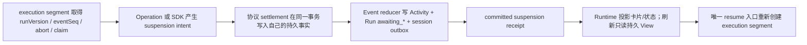

# Assistant Suspension 收敛设计（2026-07-11）

## 目标与边界

本次是 `BUG-AR-003` 的 D 类 Architecture Incident 收敛，不是为五种 Choice 增加例外。

目标是让 Assistant 在需要外部结果时，统一用少量**暂停协议**表达事实：

| 协议 | 持久事实 | 恢复入口 |
| --- | --- | --- |
| `choice` | 不可变 Offer、pending Interruption、waiting Activity、`awaiting_choice` Run | 用户提交已校验的 ChoiceDecision |
| `approval` | pending Interruption、冻结的 SDK RunState、waiting Activity、`awaiting_approval` Run | 用户批准或拒绝同一 approval identity |
| `task` | Task batch、Run Wait、waiting Activity、`awaiting_task` Run | Outbox 的唯一 continuation command |

同一协议的新增实例只能新增 registry 声明和业务内容；不得修改 operation invocation、execution fence、stop controller 或 UI projector 的 operation-id 分支。新的协议类型必须一次性补齐声明、唯一 settlement、唯一 resume、投影与 conformance，不能为某个 operation 添加例外。

不在本阶段改变的边界：不替换 MySQL + Redis + BullMQ 持久运行模型；不把 Agent SDK 的进程内 waiter 当成可恢复状态；不为已经自包含的 Interaction 卡片复制第二份 UI 状态。

## 历史分诊与根因

| 项目 | 事实 |
| --- | --- |
| 历史缺陷 | `BUG-AR-003`；Choice 成功写入 Offer/Interruption/Activity，并把 Run 合法推进到 `awaiting_choice` 后，调用层仍以「Run 必须是 running」作 post-invocation fence。 |
| 逃过既有测试的原因 | 原测试把 Choice 当作 `running -> awaiting_choice` 的特殊后置状态，并只验证“例外能通过”；它没有证明 fence 只裁决执行资格，也没有让 Choice、Approval、Task 复用同一个协议结果。 |
| 真正错误 | `run.status` 同时被拿来表示“业务正在等什么”和“这一段执行是否仍有提交权”。前者可以合法变成 awaiting，后者必须由 execution segment、run version、event sequence、abort/claim 所有权裁决。 |
| 不可接受的修复 | 在 invocation 中按五种 Choice / operation id 放行，或继续给 `awaiting_choice` 增加 post-fence 白名单。 |

## 目标模型

一个 Run 是逻辑工作；一次模型/工具执行是该 Run 的 execution segment；暂停是 segment 的正常结算结果，不是执行失效。

`ProjectAgentOperationExecutionFence` 只证明“这一个 execution segment 在提交时仍持有资格”：Run identity、`runVersion + eventSeq`、abort signal，以及 continuation 时的 Wait claim。它不得在操作提交后用业务 `status` 重新判决结果；因此不再有 `running`/`awaiting_choice` 的 post-invocation 分支。

每个成功的暂停 settlement 都生成强类型 `SuspensionReceipt`。receipt 不是第二份持久状态，而是“刚刚提交的事务”的带身份回执：

- Choice：run、operation、activity、interruption、card、toolCall、choiceType；
- Approval：run、operation、activity、interruption、approval、toolCall；
- Task：run、operation、activity、wait、Task batch、follow-up mode。

Invocation 只在 operation 明确声明需要某种暂停协议时要求匹配 receipt；它不读取 Run status，也不为具体 Choice 写判断。Stop controller 同样只根据 operation 的协议声明和已提交 receipt 判定停止，不能根据 Edit-first 工具名、文案或输出猜测。

## 事实、唯一写入者与事务边界

| 事实 | 唯一写入者 / 事务 | 消费者 |
| --- | --- | --- |
| execution eligibility | Run fence + execution segment；事务内 barrier 锁 Run/Wait claim | invocation、Task/plan/direct commit |
| Choice / Approval 的 pending Interaction | `settleProjectAgentInterruptionSuspension`；锁 Run、替换旧 pending、写 Event/Activity/Interruption/Outbox | runtime、Session、control route |
| Task batch 与等待 | `persistSubmittedTaskBatchInTransaction` callback → `bindProjectAgentWaitToTasksInTransaction`；Task/billing/outbox/Wait/Activity/Run 同一事务 | Outbox continuation、Session |
| 业务等待状态 | Event reducer，只有它推进 Run 到 `awaiting_*` | Session resolver、runtime status |
| 协议结算回执 | 当前 execution fence 的内存 scoped receipt，且只能在上述事务成功提交后登记 | invocation、tool adapter、stop controller |
| assistant prose | Thread persistence；它是对持久 Interaction/Task 的说明，不是暂停协议事实 | Thread UI |

Choice/Approval 卡片已经包含继续所需的完整 Offer；Task Wait 已经包含继续所需的 Task identity。因而“模型说明文字”和“可恢复交接事实”不是同一事实，也不应靠一笔跨越模型流的事务强行绑定。真正必须原子的是每个协议自身的交接事实。正常路径仍持久化 assistant message；此次移除误报 fence 后，Choice 不再把成功回执转换成 stream error，刷新会同时恢复其已提交的文本与卡片。真实进程崩溃若发生在文本写入前，Session 仍可从自包含 Interaction/Wait 恢复，不会丢失可继续状态。

## 全部入口清单

| 阶段 | 当前/目标权威入口 | 要删除的旧解释 |
| --- | --- | --- |
| Tool invocation | `invokeProjectAgentOperation` | `effects.writes` 推断 Run outcome；post-invocation `running` 检查 |
| Choice settlement | `settleProjectAgentInterruptionSuspension(kind: choice)` | Choice 专属 post-fence 和 `choiceExecutionOutcome` |
| Approval settlement | `settleProjectAgentInterruptionSuspension(kind: approval)` | runtime 直接创建 approval 的旁路 |
| Task settlement | `bindProjectAgentWaitToTasksInTransaction` 返回 Task receipt | runtime 在 Task commit 后补建 Wait；只按工具输出猜测 batch |
| Runtime stop | protocol declaration + committed receipt | `isEditFirstChoiceToolId`、硬编码 tool name、Run status 反推合法性 |
| 用户恢复 | `consumeProjectAgent*Interruption` / Outbox continuation | route、客户端、timer、refetch 的第二续跑入口 |
| UI | Session/Thread 的持久 View | 历史消息、tool output、DOM、文案猜测等待状态 |

修改前后数量：Choice 由“工具写入 + Choice 专属 post verifier + generic post verifier”三个解释点收敛为“协议 settlement + 通用 receipt verifier”两个职责（写入与读取）；Run status 不再参与 execution postcondition。Approval 和 Task 接入同一 receipt type 后，runtime 的停止结论不再有按业务 Choice identity 的分支。

## 时序、失败与恢复

1. segment 开始前和每个可写事务提交前验证 fence；丢失 abort、Run version/event sequence 或 Wait claim 时整笔事务回滚。
2. 协议 settlement 失败则没有新 pending Interaction/Wait、没有 `awaiting_*`、没有 receipt；runtime 走显式失败路径，不得显示“工具调用失败”作为成功卡片后的补偿。
3. settlement 成功后，receipt 与实际持久 identity 一一对应；重复记录不同 receipt 必须 conflict，重复同一 receipt 幂等。
4. 用户重复/并发点击依旧由 pending → consumed 的 CAS 保护；Task resume 依旧由 Outbox command + continuation checkpoint 保护。
5. 刷新、断线、重放只读取 Run + Activity + Interruption/Wait + Thread 的持久 projection；通知仅帮助刷新，不能承载正确性。
6. 旧 execution segment 晚到时，version/event sequence 或 claim 已改变，不能写领域事实、等待事实或 terminal 结果。

## 删除与迁移

本阶段不引入 schema migration；已有 Run、Activity、Interruption、Wait、Event、Outbox 和 execution segment 已足以承载协议。

必须删除：

- `resolveProjectAgentOperationPostInvocationStatus`；
- `assertProjectAgentOperationExecutionFenceAfterInvocation`；
- `assertProjectAgentChoiceExecutionFenceAfterInvocation`；
- `choiceExecutionOutcome` 及 Choice 专属 record API；
- 所有 `agentFlow.interruptsFor`、Edit-first 工具名推断的暂停分支。

替换为：协议级 `suspendsFor` 声明、`SuspensionReceipt`、通用 receipt verifier，和 Choice/Approval 共用的 Interruption settlement authority。没有双轨兼容期；所有已注册 Choice 同时迁移。

## 验证矩阵与已知盲区

| 风险 | 证明层 |
| --- | --- |
| Choice 成功变 awaiting 不再被报为 `run_not_running` | unit + `BUG-AR-003` history scenario |
| 缺少/外来/错协议 receipt 不能让 Tool 成功 | unit invocation/fence conformance |
| Choice、Approval 同一个 Run 锁事务中替换、raise、回执 | unit interruption settlement + real MySQL integration |
| Task 只在 batch commit 后产生 receipt，identity 与 Wait/Task batch 一致 | unit + task integration |
| 新 Choice 仅 registry 内容即可复用 invocation/fence/stop | registry conformance + source guard |
| 刷新恢复 card/Wait，而非依赖流内存 | system reload journey（真实 MySQL） |
| 旧 segment、丢锁、claim 丢失 | existing fence/continuation integration + targeted additions |
| OpenAI Agents SDK 0.13.x 升级 | focused runtime/approval serialization tests；SDK 本身不接管持久 Run/Wait/Outbox |

完整验证只在所有改动完成后执行一次；开发过程只运行受影响的 unit/integration/guard 集合。若真实 MySQL 或必跑 runner 不可用，必须报告为未验证盲区，不能声称架构完成。
