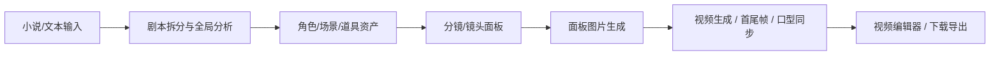
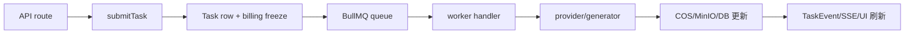

# waoowaoo 项目结构梳理

> 生成时间：2026-05-27  
> 最近校准：2026-05-27，按当前工作区源码重新读取。  
> 目的：为后续项目优化提速提供结构地图。本文只记录当前代码事实和优化定位入口，不直接规定优化方案。  
> 注意：后续代码更新后，以当前源码为准重新校准，不沿用旧分支逻辑。

## 1. 项目定位

`waoowaoo` 是一个基于 Next.js 的 AI 影视/短剧制作工作台。核心链路是：



主要技术栈：

- Web 框架：Next.js 15、React 19、App Router
- 数据库：MySQL、Prisma
- 队列：Redis、BullMQ
- 存储：COS / MinIO / Local storage 适配
- AI provider：ComfyUI、百炼、Fal、Google、OpenAI-compatible、MiniMax、Vidu 等
- 测试：Vitest，按 unit / integration / system / regression 分层

## 2. 顶层目录职责

| 路径 | 职责 | 优化关注点 |
| --- | --- | --- |
| `src/app` | Next.js 页面和 API Route | 路由请求耗时、服务端查询、接口提交任务路径 |
| `src/app/[locale]` | 多语言页面入口 | 页面拆分、客户端状态、组件渲染负担 |
| `src/app/api` | 后端 API Route | 认证、参数校验、数据库读写、任务提交 |
| `src/components` | 通用 UI 与业务共享组件 | 重复渲染、组件边界、通用交互 |
| `src/features/video-editor` | 视频编辑器功能区 | 时间轴、Remotion 预览、编辑状态 |
| `src/lib` | 核心业务、provider、队列、存储、模型、计费 | 优化主战场 |
| `src/lib/workers` | BullMQ worker 入口和任务 handler | 异步任务耗时、并发、重试、长链路恢复 |
| `src/lib/providers` | 外部 AI provider 封装 | Provider 调用耗时、超时、轮询、上传下载 |
| `src/lib/generators` | 模型生成适配层 | 模型路由、参数转换、媒体生成统一入口 |
| `src/lib/model-gateway` | OpenAI-compatible / provider gateway | 模型协议适配、模板媒体生成、网关超时 |
| `src/lib/novel-promotion` | 小说推视频业务领域逻辑 | 分镜、视频 readiness、角色场景同步 |
| `src/lib/task` | 任务提交、状态、事件、队列分发 | 任务状态一致性、轮询/SSE、启动恢复 |
| `src/lib/run-runtime` | run-centric 长流程运行时 | 长链路步骤恢复、重试、事件发布 |
| `src/lib/query` | React Query hooks 与 mutation | 客户端重复请求、缓存 key、乐观状态 |
| `src/lib/storage` / `src/lib/media` | 存储和媒体对象 | 签名 URL、媒体规范化、上传下载重复 |
| `src/lib/assets` | 资产库服务与映射 | 角色/场景/道具读取、资产选择和回写 |
| `prisma` | Schema 和迁移 | 查询索引、关系加载、任务表增长 |
| `lib/prompts` | Prompt 模板文本 | prompt 加载、语义回归、LLM 链路稳定性 |
| `messages` | i18n 文案 | 文案键、页面语言包加载 |
| `standards` | 能力/价格/prompt canary 标准数据 | 模型能力和计费校验 |
| `scripts` | 开发、日志、guard、审计脚本 | 优化验证工具入口 |
| `tests` | 测试集合 | 回归覆盖和优化验证依据 |
| `docs` | 项目文档和计划 | 优化计划、结构说明、决策记录 |

## 3. 运行入口

### 开发启动

`package.json` 里的主要脚本：

- `npm run dev`：同时启动 Next.js、worker、watchdog、Bull Board。
- `npm run dev:next`：启动 Web 服务。
- `npm run dev:worker`：启动 `src/lib/workers/index.ts`。
- `npm run dev:watchdog`：启动 `scripts/watchdog.ts`。
- `npm run dev:board`：启动 `scripts/bull-board.ts`。
- `npm run storage:init`：初始化存储。

### 生产启动

- `npm run build`：`prisma generate && next build`
- `npm run start`：同时启动 Next、worker、watchdog、Bull Board

### 常用验证

- `npm run typecheck`
- `npm run lint -- <files>`
- `BILLING_TEST_BOOTSTRAP=0 npx vitest run <tests>`
- `npm run test:all`
- `npm run verify:commit`

## 4. 前端结构

主要页面路径：

| 路径 | 职责 |
| --- | --- |
| `src/app/[locale]/home` | 首页 |
| `src/app/[locale]/auth` | 登录/认证页面 |
| `src/app/[locale]/profile` | API 配置、默认模型、用户配置 |
| `src/app/[locale]/workspace/[projectId]` | 项目工作台 |
| `src/app/[locale]/workspace/asset-hub` | 全局资产库 |
| `src/app/m/[publicId]` | 移动/公开访问入口 |

小说推视频工作台主要在：

```text
src/app/[locale]/workspace/[projectId]/modes/novel-promotion
```

其下重点模块：

- `components/assets`：资产面板。
- `components/script-view`：剧本/分集/分镜视图。
- `components/smart-import`：智能导入。
- `components/storyboard`：分镜组、面板、图片生成入口。
- `components/video`：视频阶段 UI。
- `components/voice` / `voice-stage`：配音和音频阶段。
- `hooks`：工作台状态、执行流、数据加载。

视频阶段重点文件：

- `VideoPanelCard.tsx`：单个分镜视频卡片。
- `panel-card/runtime/videoPanelRuntimeCore.tsx`：卡片运行态组装。
- `runtime/hooks/usePanelVideoModel.ts`：视频模型选择。
- `runtime/hooks/usePanelVideoDurationBinding.ts`：视频时长与音频绑定。
- `runtime/hooks/usePanelTaskStatus.ts`：任务状态。
- `runtime/hooks/usePanelVoiceManager.ts`：配音关联。

后续优化视频阶段时，优先查这些 runtime hooks，再查 API 和 worker。

## 5. API Route 结构

API 统一放在 `src/app/api`。多数 route 使用 `apiHandler` 包装，常见职责是：

1. 鉴权。
2. 读取项目/用户配置。
3. 参数校验。
4. 数据库读写。
5. 提交异步任务。
6. 返回任务或业务结果。

重点 API 分组：

| 路径 | 职责 |
| --- | --- |
| `src/app/api/projects` | 项目 CRUD、项目数据、成本 |
| `src/app/api/novel-promotion/[projectId]` | 小说推视频主业务 API |
| `src/app/api/asset-hub` | 全局资产库 API |
| `src/app/api/assets` | 统一资产 API |
| `src/app/api/tasks` | 任务查询、取消、dismiss |
| `src/app/api/task-target-states` | 目标态聚合 |
| `src/app/api/runs` | run-centric 长流程 |
| `src/app/api/user/api-config` | provider/model 配置中心 |
| `src/app/api/user/models` | 可用模型列表 |
| `src/app/api/storage` / `cos` / `files` | 文件访问与签名 |

视频生成相关 API：

- `novel-promotion/[projectId]/generate-video/route.ts`
- `novel-promotion/[projectId]/lip-sync/route.ts`
- `novel-promotion/[projectId]/restore-video/route.ts`
- `novel-promotion/[projectId]/video-urls/route.ts`
- `novel-promotion/[projectId]/video-proxy/route.ts`

图片生成相关 API：

- `generate-image`
- `generate-character-image`
- `regenerate-panel-image`
- `regenerate-group`
- `modify-storyboard-image`
- `modify-asset-image`
- `panel-variant`

## 6. 任务与队列

任务模型定义在 `src/lib/task/types.ts`。队列分发在 `src/lib/task/queues.ts`。

BullMQ 队列：

| 队列 | 名称 | 主要任务 |
| --- | --- | --- |
| image | `waoowaoo-image` | 面板图、角色图、场景图、资产图、图片修改 |
| video | `waoowaoo-video` | 分镜视频、口型同步 |
| voice | `waoowaoo-voice` | 配音、音色设计 |
| text | `waoowaoo-text` | 剧本分析、分镜生成、LLM 修改、长流程 |

Worker 入口：

- `src/lib/workers/index.ts`：启动全部 worker，并执行启动恢复。
- `src/lib/workers/image.worker.ts`
- `src/lib/workers/video.worker.ts`
- `src/lib/workers/voice.worker.ts`
- `src/lib/workers/text.worker.ts`

Task handler 目录：

```text
src/lib/workers/handlers
```

优化异步任务耗时时，优先从下面路径跟：



关键文件：

- `src/lib/task/submitter.ts`：任务提交入口。
- `src/lib/task/service.ts`：任务状态和任务记录。
- `src/lib/task/state-service.ts`：任务目标态。
- `src/lib/task/publisher.ts`：任务事件发布。
- `src/lib/workers/shared.ts`：worker 生命周期包装、进度上报。
- `src/lib/workers/user-concurrency-gate.ts`：用户级并发控制。

## 7. AI Provider 与生成层

Provider 封装在：

```text
src/lib/providers
```

主要 provider：

- `comfyui`：本地/远程 ComfyUI 工作流。
- `bailian`：百炼 LLM、图片、视频、TTS、音色。
- `fal`：Fal 队列型接口。
- `official`：官方模型注册。
- `siliconflow`：硅基流动模型。
- `codex`：Codex provider。

生成适配层在：

```text
src/lib/generators
```

重点文件：

- `factory.ts`：按 provider/model 创建生成器。
- `comfyui.ts`：ComfyUI 图片等生成适配。
- `comfyui-video.ts`：ComfyUI 视频生成适配。
- `ark.ts`、`fal.ts`、`minimax.ts`、`official.ts`、`vidu.ts`：其他 provider 适配。
- `image/*`、`video/*`、`audio/*`：按媒体类型拆分的 provider 适配。

## 8. ComfyUI 工作流

ComfyUI 核心代码：

- `src/lib/providers/comfyui/client.ts`：上传媒体、提交 prompt、轮询队列/历史、取结果。
- `src/lib/providers/comfyui/workflow-registry.ts`：读取/转换 workflow JSON，注入 prompt、图片、音频、尺寸、时长等参数。
- `src/lib/providers/comfyui/ltx23-workflow-profiles.ts`：LTX2.3 workflow profile。
- `src/lib/providers/comfyui/ltx23-workflow-router.ts`：LTX2.3 自动选择逻辑。
- `src/lib/providers/comfyui/workflows`：内置 workflow JSON。

当前内置 workflow 分类：共 20 个 JSON，按当前 `src/lib/providers/comfyui/workflows` 读取。

```text
baseaudio
  三人/s2-three
  单人/LongCat-one
  单人/s2-one
  多人/LongCat-two
  多人/s2-two
  音色/s2-se

baseimage
  图片分镜/Qwen剧情分镜制作
  图片生成/Flux2Klein文生图
  图片生成/ZImageTurbo造相
  图片编辑/Flux2多图编辑
  图片编辑/qwen三图编辑
  图片编辑/qwen单图编辑
  图片编辑/qwen双图编辑

basevideo/ltx23-profiles
  t8-smart-vbvr-390k-v2
  t8-sulphur2-promptrelay-micro
  t8-single-image-large-motion-4stage
  goon-first-last-frame-2stage
  damaicha-image-to-30s-long-video
  damaicha-long-video-promptrelay
  damaicha-aio-v2-no-subtitles
```

当前已不包含 `basevideo/图生视频/Wan2.2Remix图生视频`、`baseimage/图片视角切换/单图视角切换`、`baseimage/图片视角切换/单图视角切换提示词版本`。

工作流优化时要区分两类问题：

- “可见模型列表太多”：改 `src/app/[locale]/profile/components/api-config/types.ts`、`src/lib/api-config.ts`、`src/app/api/user/models/route.ts`。
- “实际生成慢”：查 `client.ts` 的上传/轮询/下载、`workflow-registry.ts` 的注入、worker 的并发和 provider 超时。

LTX2.3 当前分三层：

- `ltx23-workflow-profiles.ts`：profile 元数据、时长、FPS、图片槽位策略。
- `ltx23-workflow-router.ts`：自动推荐工作流，按时长、首尾帧、微动、大幅运动、PromptRelay 特征路由。
- `workflow-registry.ts`：把 profile 的时长、帧数、PromptRelay、图片/音频输入写入 ComfyUI graph。

优化时不要只删 JSON；还要同步检查模型列表、profile、router、测试和配置中心。

## 9. 模型配置、能力与计费

模型配置入口：

- `src/lib/api-config.ts`：服务端读取用户 provider/model 配置。
- `src/app/api/user/api-config/route.ts`：配置中心 API。
- `src/app/api/user/models/route.ts`：用户可选模型列表。
- `src/app/[locale]/profile/components/api-config`：配置页 UI。

模型能力：

- `standards/capabilities/image-video.catalog.json`
- `src/lib/model-capabilities/catalog.ts`
- `src/lib/model-capabilities/lookup.ts`
- `src/lib/model-capabilities/video-effective.ts`

计费：

- `standards/pricing/image-video.pricing.json`
- `src/lib/model-pricing/*`
- `src/lib/billing/*`
- `src/lib/billing/task-policy.ts`

优化模型路由时，必须同步考虑：

1. 配置中心是否显示。
2. 能力 catalog 是否支持。
3. 价格 catalog 是否能匹配。
4. 任务提交 billing payload 是否正确。

## 10. 数据库结构

Prisma schema：

- MySQL：`prisma/schema.prisma`
- SQLite variant：`prisma/schema.sqlit.prisma`

主要业务模型：

- `NovelPromotionProject`：小说推视频项目。
- `NovelPromotionEpisode`：分集。
- `NovelPromotionClip`：剧情片段。
- `NovelPromotionStoryboard`：分镜组。
- `NovelPromotionPanel`：分镜面板，含图片、视频、提示词、时长绑定。
- `NovelPromotionVoiceLine`：台词和音频。
- `NovelPromotionCharacter` / `CharacterAppearance`：角色和形象。
- `NovelPromotionLocation` / `LocationImage`：场景和场景图。
- `MediaObject`：媒体对象统一记录。
- `Task` / `TaskEvent`：任务与事件。
- `UserPreference`：用户模型/provider/default 配置。
- `UserBalance` / 计费相关表：费用与冻结记录。
- `GlobalCharacter` / `GlobalLocation` / `GlobalVoice`：全局资产库。

性能排查优先关注：

- `Task` / `TaskEvent` 表增长后的查询。
- `NovelPromotionPanel` 批量加载时是否过度 include。
- voice line 与 panel 匹配查询是否 N+1。
- media 签名 URL 是否重复生成。

## 11. Prompt 与 i18n

Prompt 模板：

- `lib/prompts/novel-promotion`
- `lib/prompts/video`
- `lib/prompts/voice-design`
- `lib/prompts/character-reference`
- `src/lib/prompt-i18n/*`

语言包：

- `messages/zh`
- `messages/en`

Prompt 优化或模型替换时要查：

- `src/lib/prompt-i18n/catalog.ts`
- `src/lib/prompt-i18n/prompt-ids.ts`
- `standards/prompt-canary`
- `scripts/guards/prompt-*.mjs`

## 12. 测试结构

| 路径 | 职责 |
| --- | --- |
| `tests/unit` | 函数、组件、worker handler、provider 单元测试 |
| `tests/integration/api` | API 行为和契约 |
| `tests/integration/chain` | 任务链路/队列链路 |
| `tests/integration/run-runtime` | run-centric 长流程 |
| `tests/integration/provider` | provider 集成 |
| `tests/concurrency` | 并发与计费 |
| `tests/system` | 系统级场景 |
| `tests/regression` | 回归用例 |
| `tests/contracts` | 路由、任务类型、需求矩阵 |
| `tests/helpers` | 测试 helper |

常用精准测试：

- API direct submit：`tests/integration/api/contract/direct-submit-routes.test.ts`
- ComfyUI workflow：`tests/unit/providers/comfyui-workflow-registry.test.ts`
- ComfyUI client：`tests/unit/providers/comfyui-client.test.ts`
- 视频生成器：`tests/unit/generators/comfyui-video.test.ts`
- 视频 worker：`tests/unit/worker/video-worker.test.ts`
- 图片 worker：`tests/unit/worker/panel-image-task-handler.test.ts`
- 任务/队列：`tests/unit/task`、`tests/unit/worker`

## 13. 优化排查入口

### 13.1 视频生成慢

优先查：

1. `src/app/api/novel-promotion/[projectId]/generate-video/route.ts`
2. `src/lib/workers/video.worker.ts`
3. `src/lib/generators/comfyui-video.ts`
4. `src/lib/providers/comfyui/client.ts`
5. `src/lib/providers/comfyui/workflow-registry.ts`
6. `src/lib/providers/comfyui/ltx23-workflow-router.ts`

常见瓶颈：

- API readiness 做 N+1 查询。
- worker 串行上传/下载大媒体。
- ComfyUI queue poll 间隔和超时过长。
- workflow 选错，短视频误走长视频 profile。
- 重复签名/重复 normalize 图片。

### 13.2 图片生成慢

优先查：

1. `src/app/api/novel-promotion/[projectId]/generate-image/route.ts`
2. `src/lib/workers/handlers/panel-image-task-handler.ts`
3. `src/lib/workers/handlers/image-task-handler-shared.ts`
4. `src/lib/media/outbound-image.ts`
5. `src/lib/providers/comfyui/client.ts`

常见瓶颈：

- 参考图过多或 base64 在任务 payload 中膨胀。
- 全局角色/场景查询重复。
- 图片 URL normalize 和上传重复。
- AI audit 或 prompt 构造在每个 panel 中重复执行。

### 13.3 页面卡顿

优先查：

1. `src/app/[locale]/workspace/[projectId]/modes/novel-promotion`
2. `src/lib/query/hooks`
3. `src/components/task`
4. `src/lib/task-target-states`

常见瓶颈：

- 面板列表一次性渲染过多。
- task target state 与 panel 数据多源同步。
- SWR/React Query key 过细导致重复请求。
- 大 JSON 字段直接进入组件树。

### 13.4 长流程不稳定

优先查：

1. `src/lib/run-runtime/service.ts`
2. `src/lib/run-runtime/recovery.ts`
3. `src/lib/run-runtime/workflow-lease.ts`
4. `src/lib/workers/handlers/story-to-script.ts`
5. `src/lib/workers/handlers/script-to-storyboard.ts`

常见瓶颈：

- step event 太多。
- retry 依赖关系不清。
- 任务恢复时重复执行已完成步骤。
- LLM stream 与 task lifecycle 状态漂移。

## 14. 建议的优化推进顺序

1. **先做观测基线**：用 `scripts/task-error-stats.ts`、日志、任务耗时字段确认慢在哪里；没有样本时先补轻量日志，不先猜。
2. **做工作流收敛**：减少 ComfyUI 可选 workflow，避免 UI 和自动路由误选；每删一个 workflow 同步查模型列表、profile、router、测试。
3. **做 API 查询收敛**：优先消除 batch API 的 N+1，尤其是 panel、voice line、task target state 聚合。
4. **做 worker payload 瘦身**：避免 base64、大 JSON、重复 signed URL 进入 task payload/progress/result。
5. **做 provider 调用优化**：上传/下载、轮询间隔、超时、并发 gate；区分 ComfyUI 队列等待和真实执行耗时。
6. **做前端渲染优化**：面板列表、任务状态覆盖层、视频卡片 runtime hooks，减少跨组件大对象传递。
7. **最后做 schema/index 优化**：只针对真实慢查询补索引，避免盲目加索引。

## 15. 当前工作区注意事项

当前分支是 `codex/ltx23-auto-workflow-selection`。后续优化前不要假设历史方案仍然有效，先按当前源码确认以下入口：

- LTX2.3 自动工作流选择。
- 视频生成 route / worker / generator。
- 删除部分不用的 ComfyUI workflow。
- 对应测试文件。
- `.gitignore` 当前也有未提交改动，和性能优化无直接关系时不要顺手改。

后续优化前建议先把当前分支稳定到：

```bash
npm run typecheck
BILLING_TEST_BOOTSTRAP=0 npx vitest run tests/unit/providers/comfyui/ltx23-workflow-router.test.ts tests/unit/generators/comfyui-video.test.ts tests/unit/worker/video-worker.test.ts tests/integration/api/contract/direct-submit-routes.test.ts
```

然后再按单一主题拆优化分支或提交，避免工作流接入、性能优化、UI 调整混在一个 diff 里。
