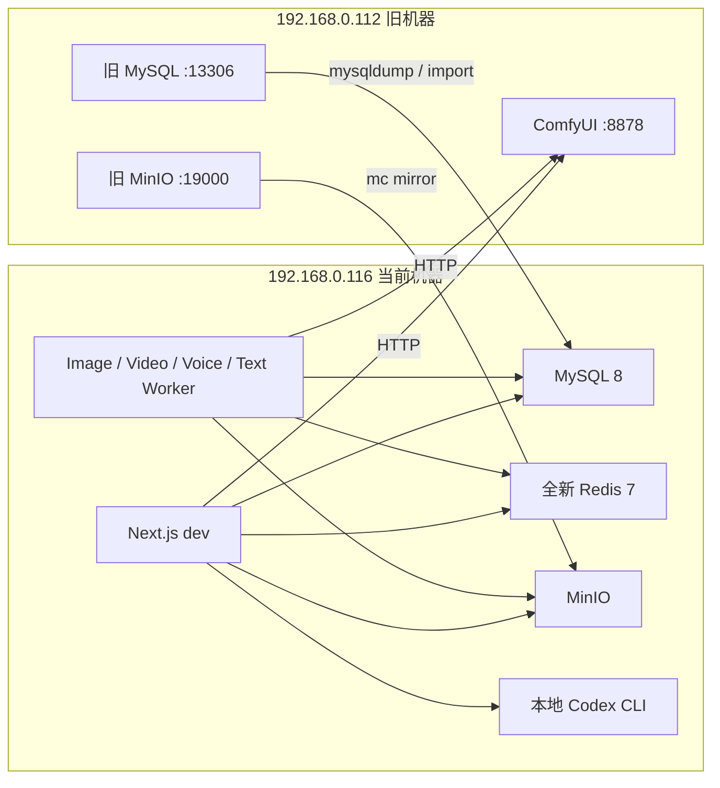

# Windows Dev 环境与数据迁移设计

## 1. 目标

将 `192.168.0.112` 上运行过的 waoowaoo 项目迁移到当前 Windows 机器 `192.168.0.116`，并在当前机器使用 `codex/codex-image-generation` 分支的本地 dev 模式继续开发。

迁移完成后的职责分工：

- `192.168.0.116`：Next.js、四类 BullMQ Worker、Watchdog、Bull Board、MySQL、Redis、MinIO、Codex CLI。
- `192.168.0.112`：只保留 ComfyUI，服务地址为 `http://192.168.0.112:8878`。

## 2. 已确认约束

- 旧机器允许完全停机，迁移不需要双写或增量同步。
- 旧机器上所有未完成的 queued/processing 任务全部放弃。
- 已完成的项目、角色、场景、图片、视频、配音、用户配置和历史记录必须保留。
- Redis 不迁移；当前机器使用全新 Redis。
- ComfyUI 本体、模型、custom nodes 和输出目录不迁移。
- ComfyUI 继续运行在 `192.168.0.112:8878`。
- 旧机器保留原 MySQL 和 MinIO 作为回滚副本，迁移验收前不删除 Docker Volume。
- 不把密码、API Key 或 `.env` 内容写入 Git。

## 3. 当前环境事实

### 当前机器 `192.168.0.116`

- Windows，C 盘约有 400 GB 可用空间。
- Docker Desktop 29.6.1 可用，当前无运行容器。
- Node/npm 尚未安装。
- 仓库尚无 `.env` 和 `node_modules`。
- 本地 Codex CLI 可用，版本为 `0.144.0-alpha.4`。
- 当前 Git 分支为 `codex/codex-image-generation`。

### 旧机器 `192.168.0.112`

- MySQL `13306` 可达，握手版本为 MySQL 8.0.45。
- Redis `16379` 可达且当前无认证，返回 `PONG`。
- MinIO `19000/19001` 可达，live/ready 健康检查返回 200。
- RDP `3389` 可达。
- SSH、SMB 和 WinRM 当前未开放。
- ComfyUI 预期端口为 `8878`，但当前机器暂时无法访问；切换前必须修正监听地址或防火墙。

## 4. 选定方案

采用逻辑迁移，不复制原始 Docker Volume：

1. MySQL 使用 `mysqldump` 生成逻辑备份并导入当前机器。
2. MinIO 使用 MinIO Client 的 `mc mirror` 在源 bucket 与目标 bucket 之间镜像。
3. Redis 使用全新实例，不迁移 AOF、RDB 或 BullMQ Job。
4. `.env`、自定义脚本和仓库外文件通过 RDP 磁盘映射复制。
5. ComfyUI 保留在旧机器，并只向当前机器开放 `8878`。

不采用 Docker Volume 复制，因为它会把数据库文件格式、Redis 队列状态和 Docker 卷布局耦合到旧机器，验证与回滚都更困难。

## 5. 目标架构

## 6. 迁移流程

### 阶段 A：源环境盘点与原始备份

通过 RDP 登录旧机器，记录以下信息：

- 项目绝对路径、Git 分支、提交和未提交文件。
- `docker compose ps`、容器镜像、Docker Volume 名称。
- `.env` 中的变量名和值，文件本身通过安全方式复制，不在终端日志输出秘密。
- MySQL 数据库名、表数量和关键表行数。
- MinIO bucket 名、对象数量和总大小。
- 项目目录中的 `data`、外挂脚本和 `COMFYUI_WORKFLOW_ROOT` 配置。

停机前先生成一份不做任何状态修正的 MySQL 原始备份。该备份是最终回滚依据。

### 阶段 B：冻结旧应用

停止旧机器上的 waoowaoo App、Worker、Watchdog 和 Bull Board，但保持以下服务运行：

- MySQL
- MinIO
- ComfyUI

应用停止后禁止再次登录或产生写入。Redis 可以保持运行直到备份结束，但其数据不进入迁移结果。

### 阶段 C：迁移 MySQL

从当前机器使用 MySQL 8 客户端连接 `192.168.0.112:13306`，导出完整数据库，包括：

- 表结构和数据
- trigger
- event
- routine
- UTF-8 字符集信息

导出文件保存在仓库外的迁移目录，并计算 SHA-256。当前机器启动空 MySQL 后导入该文件。

导入后、启动 Worker 前执行以下状态修正：

- 将 `queued` 和 `processing` Task 改为 `canceled`。
- 写入统一的迁移取消错误码和完成时间。
- 不删除 Task、TaskEvent、GraphRun 或成本历史。

然后对齐当前分支 Prisma Schema。由于项目通常使用 `prisma db push`，数据库结构升级与数据迁移分开处理：

- `prisma db push` 负责增加当前 Schema 缺少的字段和索引。
- 显式执行仓库中的 Bernini 默认视频模型迁移 SQL。
- 确认 `novel_promotion_panels.videoModel` 字段存在。

### 阶段 D：迁移 MinIO

当前机器启动新的 MinIO，保持 bucket 名与应用配置一致。使用 `mc mirror` 将旧机 bucket 镜像到当前机器：

- 首次执行全量镜像。
- 对比源、目标对象数量和总字节数。
- 在应用仍未启动的情况下执行第二次镜像，确认差异为零。
- 不使用 `--remove` 删除目标对象。

数据库和 MinIO 必须成对迁移。仅迁数据库会留下无对象的 `MediaObject.storageKey`，仅迁 MinIO 会产生无法从数据库引用的孤立对象。

### 阶段 E：迁移配置与文件

通过 RDP 磁盘映射复制以下内容：

- 旧 `.env` 的安全副本。
- 仓库外自定义脚本。
- 项目 `data` 目录。
- 旧仓库中未提交但仍需要的文件清单和压缩包。

不复制以下内容：

- `node_modules`
- `.next`
- Redis Volume
- MySQL/MinIO 原始 Volume
- 常规日志，除非用于审计

当前机器的 `.env` 以当前分支 `.env.example` 为模板重新生成。以下值必须继承或明确处理：

- `API_ENCRYPTION_KEY`：必须与旧机器相同，否则数据库里的 Provider API Key 无法解密。
- `NEXTAUTH_SECRET`：迁移初期保持一致，以避免认证状态和派生密钥变化。
- `MINIO_BUCKET`、Access Key、Secret Key：与新 MinIO 保持一致。
- `DATABASE_URL`、`REDIS_HOST`、`REDIS_PORT`、`MINIO_ENDPOINT`：改为当前机器本地 dev 服务地址。
- `NEXTAUTH_URL`：设置为当前机器实际访问地址。
- `INTERNAL_APP_URL`：本地 dev 使用 `http://127.0.0.1:3000`。

### 阶段 F：恢复 ComfyUI 连接

旧机器的 ComfyUI 必须监听局域网地址，而不是只监听 `127.0.0.1`：

- 监听 `0.0.0.0:8878` 或 `192.168.0.112:8878`。
- Windows 防火墙仅允许来源 `192.168.0.116` 访问 TCP 8878。
- 当前机器能够访问 `/system_stats` 和 `/queue` 后才启动视频/图片 Worker。
- 迁移后的用户配置中心将 ComfyUI Provider 地址设为 `http://192.168.0.112:8878`。

ComfyUI 工作流 JSON 随当前仓库提供；旧机继续负责实际模型、custom nodes 和推理运行时。

### 阶段 G：启动与验收

当前机器采用 host dev 模式：

- MySQL、Redis、MinIO 在 Docker 中运行。
- Next.js、Worker、Watchdog、Bull Board 由 `npm run dev` 在 Windows 上运行。
- Codex 图片任务调用当前机器的本地 Codex CLI。
- ComfyUI 任务调用 `192.168.0.112:8878`。

启动顺序：

1. MySQL
2. Redis
3. MinIO
4. Prisma generate 与 Schema 对齐
5. Next.js
6. Worker
7. Watchdog
8. Bull Board

## 7. 验收标准

只有以下检查全部通过才算迁移完成：

- 当前机器可以登录原用户。
- Provider API Key 能正常解密和测试连接。
- 项目、剧集、角色、场景、分镜数量与旧机一致。
- 关键业务表行数与迁移前记录一致，允许 Task 状态修正带来的字段变化。
- MinIO 源、目标对象数量和总字节数一致。
- 随机抽查图片、视频和音频可以打开。
- 数据库中不存在 `queued` 或 `processing` 的迁移前任务。
- 可以创建一个新的文本任务。
- 可以通过当前机器的 Codex CLI生成一张测试图片。
- 可以通过 `192.168.0.112:8878` 提交一项小型 ComfyUI 测试任务。
- Bull Board、日志和 Task 状态同步正常。

## 8. 回滚设计

迁移期间不修改旧机原始 MySQL/MinIO 数据，只停止应用写入。若当前机器验收失败：

1. 停止当前机器 App 和 Worker。
2. 保留当前机器导入结果用于诊断，不覆盖旧机数据。
3. 恢复旧机 App 与 Worker。
4. 将用户入口切回旧机。

旧机 MySQL、MinIO 和原始数据库 dump 至少保留到当前机器完成一次完整生成链路后。

## 9. 安全要求

- 迁移命令不在参数或日志中直接输出 Windows 密码、数据库密码、MinIO Secret 或 API Key。
- 旧机当前对局域网开放且无认证的 Redis 在切换后停止或由防火墙封闭。
- 旧机 MySQL 和 MinIO 在迁移验收完成后停止对局域网开放。
- 旧机最终只开放 RDP 和受来源限制的 ComfyUI 8878。
- 当前机器 Docker 基础设施端口仅绑定本机或通过 Windows 防火墙限制访问。
- 所有迁移备份存放在 Git 仓库外，不加入版本控制。

## 10. 非目标

- 不迁移 ComfyUI 模型、custom nodes、缓存或输出目录。
- 不恢复未完成的生成任务。
- 不迁移 Redis 队列状态。
- 不在本次工作中重构项目业务代码。
- 不删除旧机器上的 Docker Volume 或项目文件。
