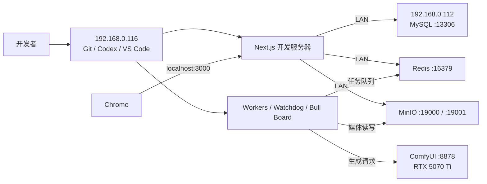

# waoowaoo 双机开发运行架构

## 1. 文档状态

- 状态：已部署并通过实际运行验证
- 生效日期：2026-07-11
- 开发机：`192.168.0.116`
- 基础设施与 GPU 计算机：`192.168.0.112`

本架构的目标是在保留本机高频代码修改体验的同时，把长期运行、占用内存和依赖 GPU 的服务集中到 `192.168.0.112`。项目只保留一个日常开发工作区，不维护两份可写源码。

## 2. 架构总览

核心边界如下：

- `192.168.0.116` 负责代码、开发进程和浏览器交互。
- `192.168.0.112` 负责持久化数据、任务队列、对象存储和 GPU 生成。
- 浏览器始终访问本机 Next.js，不直接访问 112 上的应用服务。
- 112 是 MySQL、Redis、MinIO 和 ComfyUI 的唯一正常运行端。

## 3. 机器职责

### 3.1 `192.168.0.116`：开发与应用执行端

硬件概况：16 GB 内存，Intel Core i7-8750H，NVIDIA GTX 1050 Ti。

负责运行：

| 组件 | 用途 |
| --- | --- |
| Git 工作区 | 项目唯一日常可写源码 |
| Codex、VS Code | 编码、检查和调试 |
| Chrome | 访问 `http://localhost:3000`，验证页面和操作项目 |
| Next.js 开发服务器 | 前端页面、API 路由和 Fast Refresh |
| BullMQ Workers | image、video、voice、text 四类任务执行 |
| Watchdog | 任务状态恢复与异常检测 |
| Bull Board | 本地查看 112 上 Redis 队列状态 |
| Codex CLI provider | 从本机源码环境调用 Codex 能力 |

本机不再正常运行 MySQL、Redis、MinIO 容器，Docker Desktop也不需要随 Windows 自动启动。本机 Docker 数据不能作为运行时数据源。

### 3.2 `192.168.0.112`：基础设施、数据与 GPU 端

硬件概况：64 GB 内存，Intel Core i5-13600KF，NVIDIA RTX 5070 Ti，可长期运行。

负责运行：

| 服务 | 地址 | 数据职责 |
| --- | --- | --- |
| MySQL | `192.168.0.112:13306` | 用户、项目、剧集、角色、分镜、任务等结构化数据 |
| Redis | `192.168.0.112:16379` | BullMQ 队列、任务状态和应用实时状态 |
| MinIO API | `http://192.168.0.112:19000` | 图片、视频、音频等媒体对象 |
| MinIO Console | `http://192.168.0.112:19001` | 对象存储管理界面 |
| ComfyUI | `http://192.168.0.112:8878` | 使用 RTX 5070 Ti 执行图片、视频和音频工作流 |
| Docker Desktop | 112 本机 | 承载 MySQL、Redis、MinIO 及其正式数据卷 |

112 不负责：

- 日常 Git 工作区或第二份可写源码。
- Next.js 开发服务器。
- waoowaoo 应用 Workers、Watchdog 或 Bull Board。
- Codex、VS Code、Chrome 等交互式开发工具。

## 4. 数据归属

112 上的数据是当前运行架构的正式数据源：

- MySQL Docker volume 是结构化数据唯一写入端。
- MinIO Docker volume 是项目媒体唯一持久化端。
- Redis 是当前任务队列运行端；队列状态不应在两台机器之间合并。
- ComfyUI 的模型、custom nodes、workflows、input 和 output 由 112 管理。

禁止同时启用两套基础设施并让不同应用进程分别写入。尤其不能在 `.env` 指向 112 时误启动本机队列，再让另一个应用实例连接本机 Redis，否则会形成任务分叉。

本架构不创建自动备份文件，也不把备份目录作为运行流程的一部分。

## 5. 配置边界

本机项目 `.env` 中以下连接必须指向 112：

| 配置 | 当前目标 |
| --- | --- |
| `DATABASE_URL` 主机 | `192.168.0.112:13306` |
| `REDIS_HOST` | `192.168.0.112` |
| `REDIS_PORT` | `16379` |
| `MINIO_ENDPOINT` | `http://192.168.0.112:19000` |
| ComfyUI endpoint | `http://192.168.0.112:8878` |

用户名、密码、Token 和密钥只保存在 `.env` 或服务自身的安全配置中，不进入 Git、架构文档或命令输出。

## 6. 请求和任务流

### 普通页面请求

1. Chrome 访问 116 的 `localhost:3000`。
2. Next.js 在 116 上执行页面和 API 代码。
3. API 通过局域网读取 112 的 MySQL、Redis 和 MinIO。
4. 页面继续由 116 返回，因此保留 Fast Refresh 与本地错误提示。

### 异步生成任务

1. Next.js 把任务写入 112 的 Redis。
2. 116 上对应 Worker 从 Redis 获取任务。
3. Worker 调用模型服务；ComfyUI 类型任务发送到 112 的 `8878`。
4. 生成结果写入 112 的 MinIO。
5. Worker 更新 112 的 MySQL 与 Redis 状态。
6. Chrome 通过 SSE 或状态查询看到结果。

## 7. 代码更新与重启规则

| 修改内容 | 是否需要手动重启 |
| --- | --- |
| React 组件、CSS、客户端代码 | 不需要，Next.js Fast Refresh |
| 普通 API Route、服务端 TypeScript | 通常不需要，Next.js 自动编译 |
| Worker handler | 不需要，`tsx watch` 自动重启 Worker |
| Watchdog、Bull Board 代码 | 不需要，各自的 `tsx watch` 自动重启 |
| `.env` | 需要重启整个本地开发进程树 |
| `package.json`、lockfile、依赖 | 安装依赖后重启受影响进程 |
| Prisma schema | 执行确认过的 schema 操作、生成 Prisma Client，再重启受影响进程 |
| Next.js 启动参数或进程编排 | 需要重启整个本地开发进程树 |
| 112 上 MySQL、Redis、MinIO 配置 | 只重启对应 Docker 服务 |
| ComfyUI 模型、节点或启动参数 | 按 ComfyUI 要求重启 112 上的 ComfyUI |

因此，高频前端和后端业务代码修改仍在 116 上完成，绝大部分修改不需要人工重启，也不需要同步代码到 112。

## 8. 启动顺序

### 112

1. 启动 Windows 和 Docker Desktop。
2. 确认 MySQL、Redis、MinIO 容器运行。
3. 启动 ComfyUI。
4. 确认端口 `13306`、`16379`、`19000`、`19001`、`8878` 可访问。

### 116

1. 确认能够访问 112 的五个端口。
2. 在项目目录执行 `npm run dev`。
3. 启动过程先验证 MinIO bucket，再启动 Next.js、Workers、Watchdog 和 Bull Board。
4. 浏览器访问 `http://localhost:3000/zh`。

如果 112 尚未就绪，不应先启动 116 的 Workers，以免持续重连或产生误导性任务错误。

## 9. 停机顺序

短时间停止 116 不会影响 112 上的数据。推荐顺序：

1. 停止 116 的 `npm run dev` 进程树。
2. 保持 112 的 MySQL、Redis、MinIO 和 ComfyUI 运行，供下次开发直接使用。
3. 只有进行 112 维护或关机时，才依次停止 ComfyUI 和 Docker 服务。

112 停机前应避免仍有 active 或 waiting 任务。

## 10. 故障判断

| 现象 | 优先检查 |
| --- | --- |
| 页面打不开 | 116 的 Next.js 是否监听 `3000` |
| 页面能开但项目数据加载失败 | 112 的 MySQL `13306` 和本机 `DATABASE_URL` |
| 任务一直排队 | 112 的 Redis `16379`、116 的 Worker 进程 |
| 媒体打不开或上传失败 | 112 的 MinIO `19000`、bucket 和 endpoint 配置 |
| ComfyUI 任务失败 | 112 的 `8878`、GPU 显存、模型和 custom nodes |
| SSE 断开 | 116 的 Next.js、浏览器网络和 Redis 连接 |
| 修改代码没有生效 | 对照第 7 节判断 watcher 是否覆盖该类型修改 |

恢复时应修复当前配置或服务本身，不自动创建、恢复或合并备份文件。

## 11. 网络与安全规则

- 112 应使用固定 IP 或 DHCP 地址保留，保持 `192.168.0.112` 稳定。
- MySQL、Redis、MinIO、ComfyUI 只对可信局域网开放必要端口。
- Windows Firewall 应尽量只允许 116 访问这些端口。
- 不配置公网端口转发，不把 Redis 或 MinIO 暴露到互联网。
- MySQL、Redis 和 MinIO 保持身份验证。
- RDP 仅用于 112 的管理和故障处理。

## 12. 资源分配结论

该分工符合两台机器的硬件特点：

- 116 的 16 GB 内存主要留给 Chrome、Next.js、Worker、Codex 和编辑器。
- 112 的 64 GB 内存承担 Docker 基础设施、模型、媒体数据和长期后台服务。
- RTX 5070 Ti 专用于 ComfyUI，避免 116 的 GTX 1050 Ti 承担生成负载。
- 实际切换后，116 的可用内存从约 2.1 GB 增加到约 3.3 GB；Chrome 仍是主要内存使用者之一，浏览器优化属于独立问题。

## 13. 日常检查清单

开始开发前：

- 112 在线。
- Docker 中 MySQL、Redis、MinIO 为 running/healthy。
- ComfyUI `8878` 可访问。
- 116 的 `.env` 指向 112。
- 本机没有启动另一套 MySQL、Redis、MinIO。

启动项目后：

- `/zh` 返回 HTTP 200。
- Prisma 能连接到 112 的数据库。
- Redis 返回 `PONG`。
- MinIO bucket 验证通过。
- BullMQ 没有意外恢复的旧 active/waiting 任务。
- 工作区能加载已有项目、剧集和媒体。

## 14. 明确不采用的方案

- 不把全部应用进程都放到 112；否则 116 会退化成纯终端，且本地代码修改反馈变慢。
- 不维护两份可写源码；避免同步冲突、依赖不一致和忘记部署。
- 不在 112 上运行第二套 Next.js 或 Worker。
- 不让 116 与 112 的 MySQL、Redis、MinIO 同时作为正式数据源。
- 不把任何基础设施端口暴露到公网。
- 不在运行流程中创建自动备份文件。
